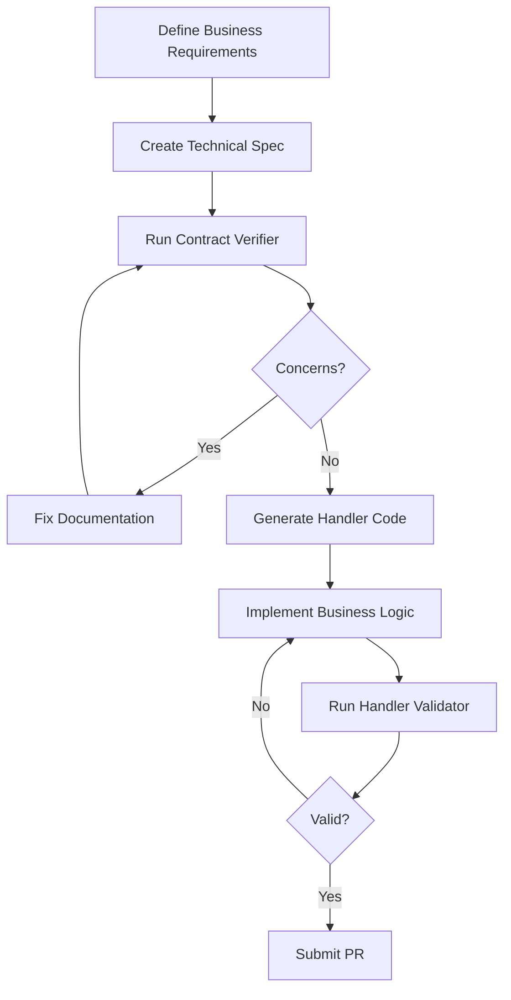

# Integration Contract Verifier Agent

**Version**: 1.0.0 | **Type**: Verification & Validation Agent | **Last Updated**: 2026-02-04

---

## Purpose

This agent verifies that cross-domain integration contracts are valid, complete, and consistent across all bounded contexts in the RiskInsure system. It ensures that publisher-subscriber agreements documented in business and technical specifications match, enabling safe code generation and preventing integration failures.

---

## Agent Overview

**Name**: `integration-contract-verifier`  
**Trigger**: `@agent integration-contract-verifier: Verify cross-domain integration contracts`  
**Scope**: Repository-wide verification of all services  
**Duration**: On-demand verification runs

---

## Responsibilities

### Primary Objectives

1. **Verify Publisher-Subscriber Agreements**: Ensure domains that subscribe to events reference valid publishers
2. **Validate Contract Consistency**: Confirm event names, contract locations, and payloads match between publishers and subscribers
3. **Check Documentation Completeness**: Ensure both business and technical docs document integration points
4. **Identify Missing Contracts**: Find events referenced in docs but missing from `PublicContracts/` or `Domain/Contracts/`
5. **Raise Concerns**: Report discrepancies with actionable remediation steps
6. **Guide Resolution**: Help developers fix integration contract issues
7. **Generate Verification Report**: Document validation results and recommendations

---

## Verification Scope

### Documents Inspected

#### Business Requirements (Per Service)
- `services/{ServiceName}/docs/business/*.md`
- Look for: Event tables, integration descriptions, cross-domain workflows

#### Technical Specifications (Per Service)
- `services/{ServiceName}/docs/technical/highlevel-tech.md`
- Required sections:
  - **Events Published** table
  - **Events Subscribed To** table (with Publishing Domain column)
  - **Integration Points** documentation

#### Contract Definitions
- `platform/RiskInsure.PublicContracts/Events/*.cs` (cross-domain public events)
- `services/{ServiceName}/src/Domain/Contracts/Events/*.cs` (internal events)
- `services/{ServiceName}/src/Domain/Contracts/Commands/*.cs` (internal commands)

#### Handler Implementations (Optional - for code validation)
- `services/{ServiceName}/src/Endpoint.In/Handlers/*Handler.cs`
- `services/{ServiceName}/src/Infrastructure/Handlers/*Handler.cs`

---

## Verification Rules

### Rule 1: Published Events Must Be Documented

**For each service**, verify:

✅ **Pass Criteria**:
- Every event in business docs appears in technical "Events Published" table
- Technical spec includes: Event Name, Purpose, Trigger, Payload Summary, Contract Location
- Contract file exists at documented location
- Contract includes standard fields: `MessageId`, `OccurredUtc`, `IdempotencyKey`

❌ **Fail Scenarios**:
- Business doc mentions event but technical spec doesn't document it
- Technical spec documents event but contract file missing
- Contract missing standard event metadata fields
- Contract location in docs doesn't match actual file path

**Example Check**:
```
Business Doc (domain-context.md) lists: FundsSettled
Technical Doc (highlevel-tech.md) Events Published table: FundsSettled ✓
Contract exists at: platform/RiskInsure.PublicContracts/Events/FundsSettled.cs ✓
Contract has MessageId, OccurredUtc, IdempotencyKey: ✓
```

---

### Rule 2: Subscribed Events Must Reference Valid Publishers

**For each service**, verify:

✅ **Pass Criteria**:
- Every event in "Events Subscribed To" table specifies a Publishing Domain
- The Publishing Domain's technical spec documents that event in their "Events Published" table
- Event name matches exactly between subscriber and publisher docs
- Contract location matches exactly between subscriber and publisher docs
- Handler name follows convention: `{EventName}Handler`

❌ **Fail Scenarios**:
- Subscriber documents event but doesn't specify publishing domain
- Publishing domain doesn't document that event in their technical spec
- Event name mismatch (e.g., subscriber: `FundsSettled`, publisher: `FundSettled`)
- Contract location mismatch between publisher and subscriber
- Handler name doesn't follow naming convention

**Example Check**:
```
Billing subscribes to: FundsSettled from FundTransferMgt
FundTransferMgt publishes: FundsSettled ✓
Event names match exactly: ✓
Contract locations match: platform/RiskInsure.PublicContracts/Events/FundsSettled.cs ✓
Handler name: FundsSettledHandler ✓
```

---

### Rule 3: Event Contracts Must Exist

**For each documented event**, verify:

✅ **Pass Criteria**:
- Contract file exists at documented location
- File contains a C# record with matching name
- Record includes all documented payload fields
- Public events are in `platform/RiskInsure.PublicContracts/Events/`
- Internal events are in `services/{ServiceName}/src/Domain/Contracts/Events/`

❌ **Fail Scenarios**:
- Contract file doesn't exist at documented path
- File exists but record name doesn't match event name
- Record missing documented payload fields
- Public event incorrectly placed in service's Domain/Contracts
- Internal event incorrectly placed in PublicContracts

**Example Check**:
```
Event: FundsSettled
Location: platform/RiskInsure.PublicContracts/Events/FundsSettled.cs ✓
File exists: ✓
Record name matches: public record FundsSettled(...) ✓
Has documented fields: CustomerId, Amount, TransactionId, SettledUtc ✓
```

---

### Rule 4: Business-Technical Alignment

**For each service**, verify:

✅ **Pass Criteria**:
- Events listed in business docs are documented in technical specs
- Technical specs explain business purpose of each event
- Business workflows align with technical integration patterns
- Event triggers in technical docs match business scenarios

❌ **Fail Scenarios**:
- Business doc describes integration but technical spec has no Events Subscribed section
- Technical spec documents event subscription without business justification
- Business workflow implies synchronous call but technical spec shows event-based
- Event purpose in technical doc contradicts business description

---

### Rule 5: Handler Implementation Validation (Optional)

**For each subscribed event**, verify (if code validation enabled):

✅ **Pass Criteria**:
- Handler class exists: `{EventName}Handler.cs`
- Implements `IHandleMessages<{EventName}>`
- Handler dependencies match documented requirements (managers, repositories)
- Handler follows thin handler pattern (validate → call manager → publish)
- Error handling strategy matches technical spec

❌ **Fail Scenarios**:
- Handler file missing for documented subscription
- Handler implements wrong event type
- Handler missing documented dependencies
- Business logic in handler (violates thin handler pattern)

**Note**: This rule is optional and can be run separately. See recommendation below.

---

## Agent Workflow

### Phase 1: Discovery

**Scan repository structure**:

1. Find all services in `services/` folder
2. Identify business docs: `services/{ServiceName}/docs/business/*.md`
3. Identify technical specs: `services/{ServiceName}/docs/technical/highlevel-tech.md`
4. List all public contracts: `platform/RiskInsure.PublicContracts/Events/*.cs`
5. List all handlers: `services/{ServiceName}/src/Endpoint.In/Handlers/*Handler.cs`

**Output**: Service inventory with document paths

```
Discovered Services:
  - Billing
    Business Docs: /services/billing/docs/business/billing-account.md, billing-payment.md
    Technical Spec: /services/billing/docs/technical/highlevel-tech.md
    Handlers: RecordPaymentHandler.cs, CreateBillingAccountHandler.cs (commands)
  
  - FundTransferMgt
    Business Docs: /services/fundstransfermgt/docs/business/domain-context.md
    Technical Spec: /services/fundstransfermgt/docs/technical/highlevel-tech.md
    Handlers: (none yet - service under development)
```

---

### Phase 2: Extract Integration Points

**For each service**:

1. **Parse business docs** - Extract event names from:
   - "Key Business Events" tables
   - Integration workflow descriptions
   - Cross-domain collaboration sections

2. **Parse technical specs** - Extract:
   - **Events Published** table rows (Event Name, Purpose, Trigger, Payload, Contract Location)
   - **Events Subscribed To** table rows (Event Name, Publishing Domain, Handler Name, Action, Contract Location)
   - Dependencies section (managers, repositories needed)

3. **Inventory contracts** - List all `.cs` files in:
   - `platform/RiskInsure.PublicContracts/Events/`
   - `services/{ServiceName}/src/Domain/Contracts/Events/`

**Output**: Integration inventory per service

```
Service: Billing
  
  Business Events Mentioned:
    - BillingAccountCreated
    - PaymentReceived
    - AccountClosed
    - (mentions receiving payment from external system)
  
  Technical - Events Published:
    - BillingAccountCreated (contract: platform/.../BillingAccountCreated.cs)
    - PaymentReceived (contract: platform/.../PaymentReceived.cs)
    - AccountClosed (contract: platform/.../AccountClosed.cs)
  
  Technical - Events Subscribed To:
    - FundsSettled (from: FundTransferMgt, handler: FundsSettledHandler, contract: platform/.../FundsSettled.cs)
    - FundsRefunded (from: FundTransferMgt, handler: FundsRefundedHandler, contract: platform/.../FundsRefunded.cs)
```

---

### Phase 3: Verify Contracts

**For each published event**:

1. ✅ Check contract file exists at documented location
2. ✅ Verify contract name matches event name
3. ✅ Confirm standard fields present (MessageId, OccurredUtc, IdempotencyKey)
4. ✅ Validate payload fields match documented summary

**For each subscribed event**:

1. ✅ Verify publishing domain is specified
2. ✅ Check publishing domain's technical spec lists this event
3. ✅ Confirm event names match exactly
4. ✅ Verify contract locations match
5. ✅ Validate handler name follows convention

**Output**: Verification results with pass/fail status

```
Event Verification Results:

PUBLISHED EVENTS:

✓ Billing.BillingAccountCreated
  - Contract exists: platform/RiskInsure.PublicContracts/Events/BillingAccountCreated.cs
  - Standard fields present: MessageId, OccurredUtc, IdempotencyKey
  - Payload matches documentation

✓ FundTransferMgt.FundsSettled
  - Contract exists: platform/RiskInsure.PublicContracts/Events/FundsSettled.cs
  - Standard fields present: MessageId, OccurredUtc, IdempotencyKey
  - Payload matches documentation

SUBSCRIBED EVENTS:

✓ Billing subscribes to FundsSettled
  - Publishing domain specified: FundTransferMgt
  - FundTransferMgt publishes FundsSettled: CONFIRMED
  - Event names match exactly: FundsSettled = FundsSettled
  - Contract locations match: Both reference platform/.../FundsSettled.cs
  - Handler name follows convention: FundsSettledHandler

✗ Billing subscribes to FundsRefunded
  - Publishing domain specified: FundTransferMgt
  - FundTransferMgt publishes FundsRefunded: NOT FOUND ⚠️
  - Contract exists but publisher doesn't document it
  
  CONCERN: Billing subscribes to FundsRefunded from FundTransferMgt, but 
  FundTransferMgt's technical spec doesn't document publishing this event.
```

---

### Phase 4: Raise Concerns

**For each violation**, generate actionable concern:

#### Concern Template

```markdown
## Concern #{Number}: {Category}

**Severity**: {Critical | High | Medium | Low}

**Service**: {ServiceName}

**Issue**: {Brief description}

**Details**:
{Detailed explanation with file paths and line numbers}

**Impact**:
{Why this matters - e.g., handler will fail at runtime, code generation impossible}

**Remediation**:
{Specific steps to fix}

**Verification**:
{How to confirm it's fixed}
```

#### Example Concerns

```markdown
## Concern #1: Missing Publisher Documentation

**Severity**: High

**Service**: FundTransferMgt

**Issue**: Event `FundsRefunded` not documented in Events Published table

**Details**:
- Billing service subscribes to `FundsRefunded` from FundTransferMgt
- Billing docs: services/billing/docs/technical/highlevel-tech.md (line 245)
- FundTransferMgt docs: services/fundstransfermgt/docs/technical/highlevel-tech.md
- FundTransferMgt publishes section does NOT include FundsRefunded

**Impact**:
- Cross-domain contract verification fails
- Developers don't know FundTransferMgt publishes this event
- Code generators can't validate subscription is valid
- Future maintainers may remove event thinking it's unused

**Remediation**:
1. Open `services/fundstransfermgt/docs/technical/highlevel-tech.md`
2. Add row to "Events Published" table:
   ```markdown
   | `FundsRefunded` | Refund processed and returned to customer | Refund transaction completes | CustomerId, RefundId, OriginalTransactionId, Amount, RefundedUtc, Reason | `platform/RiskInsure.PublicContracts/Events/FundsRefunded.cs` |
   ```
3. Verify contract exists at: platform/RiskInsure.PublicContracts/Events/FundsRefunded.cs
4. Add business justification in domain-context.md if not already present

**Verification**:
- Re-run agent: `@agent integration-contract-verifier: Verify cross-domain integration contracts`
- Concern #1 should resolve

---

## Concern #2: Contract File Missing

**Severity**: Critical

**Service**: FundTransferMgt

**Issue**: Contract file for `FundsSettled` not found at documented location

**Details**:
- Technical spec documents contract at: platform/RiskInsure.PublicContracts/Events/FundsSettled.cs
- File does NOT exist at this path
- Billing service depends on this contract

**Impact**:
- Billing handlers cannot compile (missing type reference)
- Integration broken at compile time
- Cannot generate handler code

**Remediation**:
1. Create contract file: `platform/RiskInsure.PublicContracts/Events/FundsSettled.cs`
2. Define record with documented fields:
   ```csharp
   namespace RiskInsure.PublicContracts.Events;
   
   public record FundsSettled(
       Guid MessageId,
       DateTimeOffset OccurredUtc,
       Guid CustomerId,
       decimal Amount,
       Guid PaymentMethodId,
       string TransactionId,
       DateTimeOffset SettledUtc,
       string IdempotencyKey
   );
   ```
3. Add to project: platform/RiskInsure.PublicContracts/RiskInsure.PublicContracts.csproj
4. Build solution to verify

**Verification**:
- File exists and solution builds
- Re-run agent verification

---

## Concern #3: Handler Name Convention Violation

**Severity**: Medium

**Service**: Billing

**Issue**: Handler name doesn't follow convention

**Details**:
- Expected handler name: FundsSettledHandler
- Actual handler name: ProcessFundsSettledEventHandler
- File: services/billing/src/Endpoint.In/Handlers/ProcessFundsSettledEventHandler.cs

**Impact**:
- Inconsistent naming makes codebase harder to navigate
- Code generators will create duplicate handler
- Convention violation makes code review harder

**Remediation**:
1. Rename file: ProcessFundsSettledEventHandler.cs → FundsSettledHandler.cs
2. Rename class: ProcessFundsSettledEventHandler → FundsSettledHandler
3. Update any references in DI registration
4. Update technical spec if different name was documented

**Verification**:
- File and class renamed
- Solution builds
- Tests pass
```

---

### Phase 5: Interactive Resolution

After raising concerns, guide developer through fixes:

```
========================================
 Integration Contract Verification
========================================

Services Scanned: 2 (Billing, FundTransferMgt)
Events Published: 8
Events Subscribed To: 3
Contracts Verified: 11

RESULTS:
  ✓ 8 Published events verified
  ✓ 2 Subscriptions verified
  ✗ 1 Subscription has issue

CONCERNS RAISED: 3

  [Critical] Concern #2: Contract file missing for FundsSettled
  [High]     Concern #1: FundsRefunded not documented by publisher
  [Medium]   Concern #3: Handler naming convention violation

========================================

Would you like to:
  1. View detailed concerns
  2. Fix concerns interactively
  3. Generate remediation checklist
  4. Export verification report
  5. Exit

Choice:
```

**If developer chooses #2 (Fix interactively)**:

```
Let's fix Concern #2 (Critical): Contract file missing

Current State:
  - Technical spec references: platform/RiskInsure.PublicContracts/Events/FundsSettled.cs
  - File status: NOT FOUND

I can help you create this contract. Based on the documentation, here's what I'll generate:

[Shows proposed contract code]

Shall I create this file? (yes/no):
```

---

### Phase 6: Generate Report

**Create verification report**: `docs/verification-reports/integration-contracts-{timestamp}.md`

```markdown
# Integration Contract Verification Report

**Generated**: 2026-02-04 14:30:00 UTC  
**Agent**: integration-contract-verifier v1.0.0  
**Scope**: All services in repository

---

## Summary

| Metric | Count |
|--------|-------|
| Services Scanned | 2 |
| Published Events | 8 |
| Subscribed Events | 3 |
| Contracts Verified | 11 |
| Concerns Raised | 3 |
| Critical Issues | 1 |
| High Priority | 1 |
| Medium Priority | 1 |

---

## Detailed Results

### Services Scanned

1. **Billing** (`services/billing`)
   - Business Docs: ✓ Found (2 files)
   - Technical Spec: ✓ Found
   - Published Events: 3
   - Subscribed Events: 2
   
2. **FundTransferMgt** (`services/fundstransfermgt`)
   - Business Docs: ✓ Found (1 file)
   - Technical Spec: ✓ Found
   - Published Events: 5
   - Subscribed Events: 0

### Published Events Verification

✓ All published events have contracts
✓ All contracts have standard metadata fields
✓ Contract locations documented correctly

### Subscribed Events Verification

✓ 2 of 3 subscriptions verified
✗ 1 subscription has publisher documentation issue

---

## Concerns

[Full concern details as shown above]

---

## Recommendations

1. **Immediate**: Fix Critical concerns (contract files missing)
2. **High Priority**: Update publisher documentation for subscribed events
3. **Medium Priority**: Rename handlers to follow convention
4. **Long Term**: Establish pre-commit hook to run this verification

---

## Next Steps

1. Review concerns above
2. Run: `@agent integration-contract-verifier: Fix concerns interactively`
3. After fixes, verify: `@agent integration-contract-verifier: Verify cross-domain integration contracts`
4. Commit changes with message referencing this report
```

---

## Trigger Commands

### Full Verification
```
@agent integration-contract-verifier: Verify cross-domain integration contracts
@agent integration-contract-verifier: Run full verification
```

### Targeted Verification
```
@agent integration-contract-verifier: Verify Billing service integration contracts
@agent integration-contract-verifier: Verify FundTransferMgt published events
@agent integration-contract-verifier: Check if FundsSettled contract is valid
```

### Interactive Mode
```
@agent integration-contract-verifier: Fix integration concerns interactively
@agent integration-contract-verifier: Guide me through fixing contract issues
```

### Reporting
```
@agent integration-contract-verifier: Generate integration verification report
@agent integration-contract-verifier: Export verification results
```

---

## Configuration

### Severity Thresholds

**Critical**: Blocks code compilation or runtime execution
- Contract file missing
- Contract type mismatch (event vs command)
- Circular dependencies

**High**: Prevents code generation or causes confusion
- Publisher doesn't document event that subscriber depends on
- Event names don't match between publisher and subscriber
- Contract location mismatch

**Medium**: Inconsistency or convention violation
- Handler naming doesn't follow convention
- Business docs mention event but technical spec doesn't
- Missing optional fields

**Low**: Documentation improvement opportunities
- Missing event purpose description
- No business justification for subscription
- Could add more detailed payload documentation

---

## Exclusions

### Intentional Exclusions

The agent does NOT verify:
- Internal commands (only used within same service)
- Private events (only published/consumed within same service)
- Infrastructure events (NServiceBus framework messages)
- External system integration (not cross-domain)

### File Patterns to Skip
- `**/bin/**`
- `**/obj/**`
- `**/node_modules/**`
- `**/.git/**`
- `**/test/**` (handlers in tests are test doubles)

---

## Recommendation: Code Validation

### Should Code Validation Be Combined or Separate?

**Recommendation**: **Separate Agent**

#### Rationale

1. **Different Triggers**:
   - **Contract Verifier**: Run during planning, documentation updates, before implementation
   - **Code Validator**: Run after implementation, before PR merge, in CI/CD

2. **Different Scope**:
   - **Contract Verifier**: Documents (markdown, business/technical specs)
   - **Code Validator**: Code (C# handlers, managers, repositories)

3. **Different Stakeholders**:
   - **Contract Verifier**: Business analysts, architects, documentation writers
   - **Code Validator**: Developers, code reviewers, CI/CD pipeline

4. **Performance**:
   - **Contract Verifier**: Fast (text parsing)
   - **Code Validator**: Slower (code compilation, semantic analysis)

5. **Failure Impact**:
   - **Contract Verifier**: Blocks design/planning, prevents code generation
   - **Code Validator**: Blocks PR merge, prevents deployment

#### Suggested Companion Agent

Create: `.github/agents/integration-handler-validator.md`

**Responsibilities**:
- Verify handler implementations exist for all documented subscriptions
- Check handler follows thin handler pattern
- Validate handler dependencies match technical spec
- Ensure idempotency patterns are implemented
- Verify error handling matches spec
- Check that managers exist for handler delegation

**Trigger**: After code implementation, before PR merge

**Integration Point**:
```
@agent integration-contract-verifier: Verify contracts
  ↓ (contracts valid)
  [Developer implements handlers]
  ↓
@agent integration-handler-validator: Validate handler implementations
  ↓ (handlers valid)
  [PR approved and merged]
```

---

## Best Practices

### When to Run

**During Planning**:
- Before implementing new cross-domain integration
- When designing new events
- When subscribing to existing events

**During Development**:
- After updating technical specifications
- Before generating handler code
- When adding new service to repository

**During Review**:
- Before PR approval
- After documentation changes
- When refactoring integration patterns

**In CI/CD**:
- On PR to main/master
- Nightly verification runs
- Before release tagging

### Integration with Development Workflow



---

## Related Files

- [cross-domain-integration.md](../../copilot-instructions/cross-domain-integration.md) - Integration patterns and documentation templates
- [messaging-patterns.md](../../copilot-instructions/messaging-patterns.md) - Message design patterns
- [constitution.md](../../copilot-instructions/constitution.md) - Architectural principles
- [copilot-instructions.md](../copilot-instructions.md) - Development standards

---

## Version History

- **1.0.0** (2026-02-04): Initial agent specification
  - Publisher-subscriber verification
  - Contract existence validation
  - Business-technical alignment checks
  - Interactive concern resolution
  - Verification reporting
