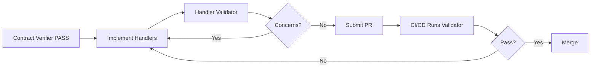

# Integration Handler Validator Agent

**Version**: 1.0.0 | **Type**: Code Validation Agent | **Last Updated**: 2026-02-04

---

## Purpose

This agent validates that message handler implementations match the integration contracts documented in technical specifications. It ensures handlers are correctly implemented, follow architectural patterns, and are ready for production deployment.

**Companion Agent**: This works with `integration-contract-verifier` to provide end-to-end integration validation.

---

## Agent Overview

**Name**: `integration-handler-validator`  
**Trigger**: `@agent integration-handler-validator: Validate handler implementations`  
**Scope**: Code validation for implemented handlers  
**Duration**: On-demand validation before PR merge

---

## Responsibilities

### Primary Objectives

1. **Verify Handler Existence**: Ensure handlers exist for all documented subscriptions
2. **Validate Handler Pattern**: Confirm thin handler pattern (validate → call manager → publish)
3. **Check Dependencies**: Verify handler dependencies match technical specification
4. **Validate Idempotency**: Ensure idempotent operations (safe to retry)
5. **Review Error Handling**: Confirm error handling matches documented strategy
6. **Test Coverage**: Verify handler unit tests exist and cover key scenarios

---

## Validation Rules

### Rule 1: Handler Implementation Required

**For each event** in "Events Subscribed To" table:

✅ **Pass Criteria**:
- Handler file exists: `src/Endpoint.In/Handlers/{EventName}Handler.cs`
- Class implements `IHandleMessages<{EventName}>`
- Handler registered in DI container (if manual registration)

❌ **Fail Scenarios**:
- Handler file missing for documented subscription
- Handler class doesn't implement correct interface
- Handler not registered (messages won't be processed)

---

### Rule 2: Thin Handler Pattern

✅ **Pass Criteria**:
- Handler delegates to manager/service (no business logic in handler)
- Manager call pattern: `await _manager.{OperationAsync}(dto, cancellationToken)`
- Publishes resulting events via `context.Publish()`
- Structured logging for operation tracking

❌ **Fail Scenarios**:
- Business logic directly in handler method
- Direct database access (should use repository via manager)
- No delegation to domain layer
- Missing logging

**Example Good Handler**:
```csharp
public class FundsSettledHandler : IHandleMessages<FundsSettled>
{
    private readonly IBillingPaymentManager _paymentManager;
    private readonly ILogger<FundsSettledHandler> _logger;

    public async Task Handle(FundsSettled message, IMessageHandlerContext context)
    {
        _logger.LogInformation(
            "Processing FundsSettled for CustomerId={CustomerId}, Amount={Amount}",
            message.CustomerId, message.Amount);

        var dto = new RecordPaymentDto
        {
            AccountId = message.CustomerId,
            Amount = message.Amount,
            ReferenceNumber = message.TransactionId,
            IdempotencyKey = message.IdempotencyKey,
            OccurredUtc = message.SettledUtc
        };

        var result = await _paymentManager.RecordPaymentAsync(dto, context.CancellationToken);

        if (!result.IsSuccess)
        {
            throw new InvalidOperationException($"Payment recording failed: {result.ErrorMessage}");
        }

        _logger.LogInformation("Payment recorded successfully");
    }
}
```

---

### Rule 3: Dependencies Match Specification

**From technical spec**, extract documented dependencies:
- Managers (e.g., `IBillingPaymentManager`)
- Repositories (if direct access documented)
- External services

✅ **Pass Criteria**:
- All documented dependencies injected via constructor
- No undocumented dependencies
- Dependencies follow interface-based injection

❌ **Fail Scenarios**:
- Missing documented dependency
- Using concrete class instead of interface
- Undocumented dependency added

---

### Rule 4: Idempotency Implementation

✅ **Pass Criteria**:
- Uses IdempotencyKey from message
- Checks for existing operation before creating
- Handles duplicate gracefully (no error on replay)
- Manager handles idempotency (handler delegates)

❌ **Fail Scenarios**:
- Ignores IdempotencyKey
- Creates duplicate records on replay
- Throws exception for duplicate operations
- No idempotency check

---

### Rule 5: Error Handling Strategy

**From technical spec**, check documented error handling:
- Retry strategy (automatic NServiceBus retries)
- Compensation strategy (saga reversal)
- Alert strategy (critical errors send alerts)

✅ **Pass Criteria**:
- Transient errors: Let NServiceBus retry
- Permanent errors: Throw with descriptive message
- Critical errors: Log as Error level
- Strategy matches technical specification

❌ **Fail Scenarios**:
- Swallows exceptions (message appears processed but isn't)
- Wrong exception type (prevents retries)
- No logging for errors
- Strategy contradicts specification

---

### Rule 6: Test Coverage

✅ **Pass Criteria**:
- Unit test file exists: `test/Unit.Tests/Handlers/{EventName}HandlerTests.cs`
- Tests cover: Success path, duplicate message, manager failure
- Mocks dependencies appropriately
- Verifies manager called with correct parameters

❌ **Fail Scenarios**:
- No tests for handler
- Missing idempotency test
- No error handling test
- Tests don't verify manager calls

---

## Validation Workflow

### Phase 1: Load Specifications

**For each service**:
1. Read `docs/technical/highlevel-tech.md`
2. Extract "Events Subscribed To" table
3. Extract "Handler Dependencies" section
4. Extract "Error Handling" section

**Output**: Handler requirements per service

```
Service: Billing

Handlers Required:
  - FundsSettledHandler
    Event: FundsSettled
    Publishing Domain: FundTransferMgt
    Dependencies: IBillingPaymentManager, ILogger
    Action: Apply payment via manager
    Error Strategy: Throw on manager failure (NServiceBus will retry)

  - FundsRefundedHandler
    Event: FundsRefunded
    Publishing Domain: FundTransferMgt
    Dependencies: IBillingPaymentManager, ILogger
    Action: Reverse payment via manager
    Error Strategy: Throw on manager failure
```

---

### Phase 2: Validate Implementations

**For each required handler**:

1. ✅ **Check file exists**
   ```
   Path: services/billing/src/Endpoint.In/Handlers/FundsSettledHandler.cs
   Exists: YES ✓
   ```

2. ✅ **Parse handler code**
   ```
   Class: FundsSettledHandler
   Implements: IHandleMessages<FundsSettled> ✓
   Dependencies: IBillingPaymentManager ✓, ILogger<FundsSettledHandler> ✓
   ```

3. ✅ **Analyze Handle method**
   ```
   Logging: YES (LogInformation calls found) ✓
   Manager delegation: _paymentManager.RecordPaymentAsync() ✓
   Error handling: Throws InvalidOperationException ✓
   Idempotency: Uses message.IdempotencyKey ✓
   Business logic in handler: NO ✓
   ```

4. ✅ **Check test coverage**
   ```
   Test file: test/Unit.Tests/Handlers/FundsSettledHandlerTests.cs
   Exists: YES ✓
   Test methods:
     - Handle_ValidMessage_CallsManager ✓
     - Handle_DuplicateMessage_HandlesIdempotently ✓
     - Handle_ManagerFails_ThrowsException ✓
   Coverage: 95% ✓
   ```

---

### Phase 3: Generate Validation Report

**Validation Results**:

```
========================================
 Handler Implementation Validation
========================================

Service: Billing

Handlers Validated: 2
  ✓ FundsSettledHandler
  ✓ FundsRefundedHandler

RESULTS:
  ✓ All handlers exist
  ✓ All handlers follow thin handler pattern
  ✓ All dependencies match specification
  ✓ All handlers are idempotent
  ✓ Error handling matches specification
  ✓ Test coverage meets thresholds (90%+)

NO CONCERNS RAISED

Service: FundTransferMgt

Handlers Validated: 0 (No subscriptions documented)

========================================
OVERALL: PASS ✓

Ready for PR approval and merge.
```

**If concerns exist**:

```
CONCERNS RAISED: 2

  [High] FundsSettledHandler: Business logic in handler method
  [Medium] FundsRefundedHandler: Missing idempotency test

See detailed concerns below...
```

---

## Example Concerns

### Concern: Business Logic in Handler

```markdown
## Concern #1: Business Logic in Handler

**Severity**: High

**Service**: Billing

**Handler**: FundsSettledHandler

**Issue**: Business logic found in handler method (violates thin handler pattern)

**Details**:
File: services/billing/src/Endpoint.In/Handlers/FundsSettledHandler.cs
Lines: 25-35

Code snippet:
```csharp
// ❌ BUSINESS LOGIC IN HANDLER - Should be in manager
if (message.Amount > 10000)
{
    // Large payment - apply hold
    account.Status = "PaymentHold";
    await _repository.UpdateAsync(account);
}
```

**Impact**:
- Business logic not in Domain layer (violates architecture)
- Not testable without message infrastructure
- Can't reuse logic from API layer
- Difficult to maintain and extend

**Remediation**:
1. Move business logic to manager: `BillingPaymentManager.RecordPaymentAsync()`
2. Manager should handle large payment logic
3. Handler should only delegate:
   ```csharp
   var result = await _paymentManager.RecordPaymentAsync(dto, context.CancellationToken);
   ```

**Verification**:
- No business logic remains in handler
- Manager contains business rules
- Handler tests mock manager
- Solution builds and tests pass
```

---

## Trigger Commands

### Full Validation
```
@agent integration-handler-validator: Validate handler implementations
@agent integration-handler-validator: Validate all handlers
```

### Service-Specific
```
@agent integration-handler-validator: Validate Billing handlers
@agent integration-handler-validator: Check FundsSettledHandler implementation
```

### Pre-PR Validation
```
@agent integration-handler-validator: Validate handlers before PR merge
@agent integration-handler-validator: Pre-merge validation
```

---

## Workflow Integration

### Development Workflow



### CI/CD Integration

```yaml
# .github/workflows/validate-handlers.yml
name: Validate Integration Handlers

on:
  pull_request:
    paths:
      - 'services/**/Handlers/**'
      - 'services/**/Domain/**'

jobs:
  validate:
    runs-on: ubuntu-latest
    steps:
      - uses: actions/checkout@v3
      
      - name: Validate Handler Implementations
        run: |
          # Run handler validator agent
          @agent integration-handler-validator: Validate all handlers
          
      - name: Check for Critical/High Concerns
        run: |
          # Fail build if Critical or High severity found
          if grep -q "Severity.*Critical\|High" validation-report.md; then
            echo "Critical or High severity concerns found"
            exit 1
          fi
```

---

## Best Practices

### When to Run

**During Development**:
- After implementing handler
- Before committing handler code
- After refactoring manager interfaces

**Before PR**:
- Final check before submitting PR
- After resolving code review comments
- After adding/updating tests

**In CI/CD**:
- On every PR to main/master
- Before deployment to staging/production
- Nightly builds (catch drift)

---

## Two-Agent Workflow

### Contract Verifier → Handler Validator

```
┌─────────────────────────────────┐
│  Integration Contract Verifier │
│  (Documentation Validation)     │
└────────────┬────────────────────┘
             │ PASS
             ↓
    ┌────────────────────┐
    │ Implement Handlers │
    └────────┬───────────┘
             ↓
┌─────────────────────────────────┐
│  Integration Handler Validator  │
│  (Code Validation)               │
└────────────┬────────────────────┘
             │ PASS
             ↓
      ┌──────────────┐
      │   PR Merge   │
      └──────────────┘
```

**Why Two Agents?**

1. **Different Validation Stages**:
   - Contract Verifier: Design/Planning phase
   - Handler Validator: Implementation phase

2. **Different Artifacts**:
   - Contract Verifier: Markdown documentation
   - Handler Validator: C# code

3. **Different Speed**:
   - Contract Verifier: Fast (text parsing)
   - Handler Validator: Slower (code compilation, semantic analysis)

4. **Different Stakeholders**:
   - Contract Verifier: Architects, business analysts
   - Handler Validator: Developers, code reviewers

---

## Configuration

### Validation Thresholds

**Test Coverage**:
- Minimum: 80% line coverage
- Target: 90%+ line coverage
- Required tests: Success, idempotency, error handling

**Cyclomatic Complexity**:
- Handler method: ≤ 5 (should be simple delegation)
- Warning if > 5 (too much logic in handler)

**Dependencies**:
- Maximum injected dependencies: 5
- Warning if > 3 (handler doing too much)

---

## Related Agents

- **[integration-contract-verifier.md](./integration-contract-verifier.md)** - Validates documentation and contracts
- **[document-manager.md](./document-manager.md)** - Manages technical documentation
- **[documentation-sync-agent.md](./documentation-sync-agent.md)** - Keeps docs in sync

---

## Version History

- **1.0.0** (2026-02-04): Initial agent specification
  - Handler existence validation
  - Thin handler pattern enforcement
  - Dependency verification
  - Idempotency checks
  - Error handling validation
  - Test coverage requirements
