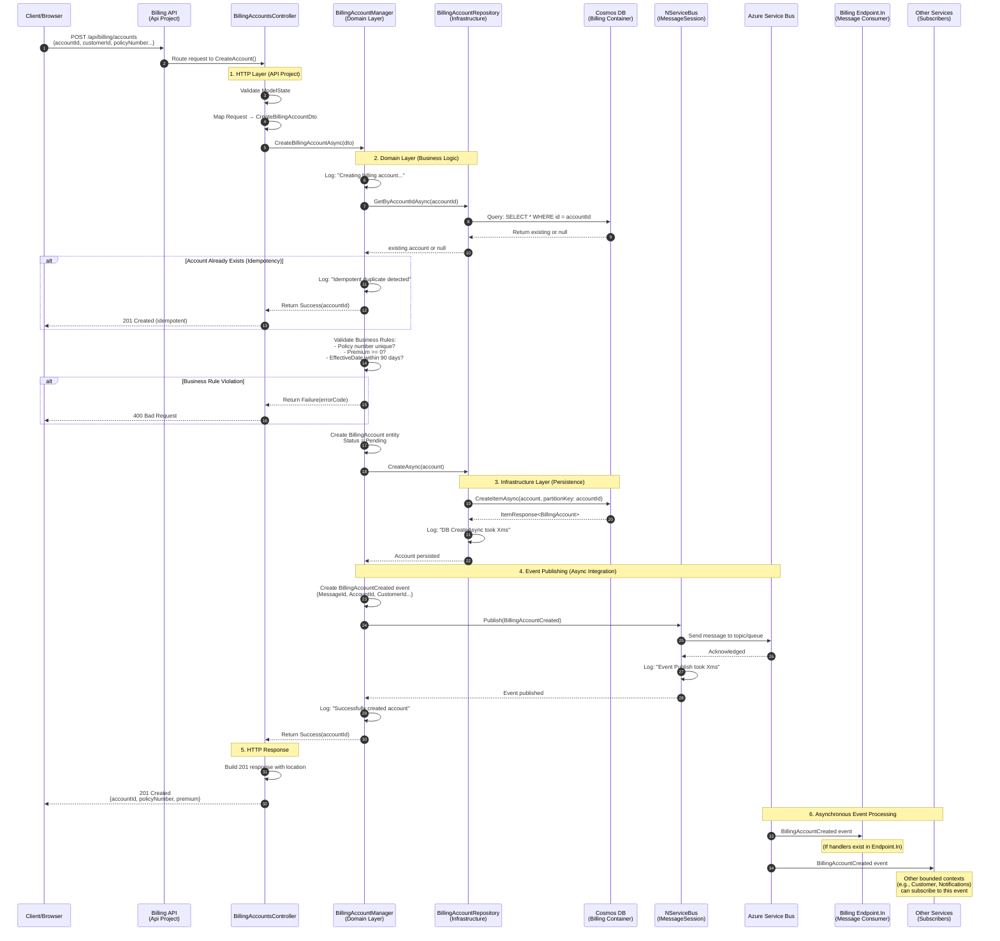

```mermaid
sequenceDiagram
    autonumber
    participant Client as Client/Browser
    participant API as Billing API<br/>(Api Project)
    participant Controller as BillingAccountsController
    participant Manager as BillingAccountManager<br/>(Domain Layer)
    participant Repo as BillingAccountRepository<br/>(Infrastructure)
    participant Cosmos as Cosmos DB<br/>(Billing Container)
    participant NSB as NServiceBus<br/>(IMessageSession)
    participant ASB as Azure Service Bus
    participant Endpoint as Billing Endpoint.In<br/>(Message Consumer)
    participant Other as Other Services<br/>(Subscribers)

    Client->>API: POST /api/billing/accounts<br/>{accountId, customerId, policyNumber...}
    API->>Controller: Route request to CreateAccount()
    
    Note over Controller: 1. HTTP Layer (API Project)
    Controller->>Controller: Validate ModelState
    Controller->>Controller: Map Request → CreateBillingAccountDto
    Controller->>Manager: CreateBillingAccountAsync(dto)
    
    Note over Manager,Repo: 2. Domain Layer (Business Logic)
    Manager->>Manager: Log: "Creating billing account..."
    Manager->>Repo: GetByAccountIdAsync(accountId)
    Repo->>Cosmos: Query: SELECT * WHERE id = accountId
    Cosmos-->>Repo: Return existing or null
    Repo-->>Manager: existing account or null
    
    alt Account Already Exists (Idempotency)
        Manager->>Manager: Log: "Idempotent duplicate detected"
        Manager-->>Controller: Return Success(accountId)
        Controller-->>Client: 201 Created (idempotent)
    end
    
    Manager->>Manager: Validate Business Rules:<br/>- Policy number unique?<br/>- Premium >= 0?<br/>- EffectiveDate within 90 days?
    
    alt Business Rule Violation
        Manager-->>Controller: Return Failure(errorCode)
        Controller-->>Client: 400 Bad Request
    end
    
    Manager->>Manager: Create BillingAccount entity<br/>Status = Pending
    Manager->>Repo: CreateAsync(account)
    
    Note over Repo,Cosmos: 3. Infrastructure Layer (Persistence)
    Repo->>Cosmos: CreateItemAsync(account, partitionKey: accountId)
    Cosmos-->>Repo: ItemResponse<BillingAccount>
    Repo->>Repo: Log: "DB CreateAsync took Xms"
    Repo-->>Manager: Account persisted
    
    Note over Manager,ASB: 4. Event Publishing (Async Integration)
    Manager->>Manager: Create BillingAccountCreated event<br/>{MessageId, AccountId, CustomerId...}
    Manager->>NSB: Publish(BillingAccountCreated)
    NSB->>ASB: Send message to topic/queue
    ASB-->>NSB: Acknowledged
    NSB->>NSB: Log: "Event Publish took Xms"
    NSB-->>Manager: Event published
    
    Manager->>Manager: Log: "Successfully created account"
    Manager-->>Controller: Return Success(accountId)
    
    Note over Controller: 5. HTTP Response
    Controller->>Controller: Build 201 response with location
    Controller-->>Client: 201 Created<br/>{accountId, policyNumber, premium}
    
    Note over ASB,Other: 6. Asynchronous Event Processing
    ASB->>Endpoint: BillingAccountCreated event
    Note over Endpoint: (If handlers exist in Endpoint.In)
    ASB->>Other: BillingAccountCreated event
    Note over Other: Other bounded contexts<br/>(e.g., Customer, Notifications)<br/>can subscribe to this event
```