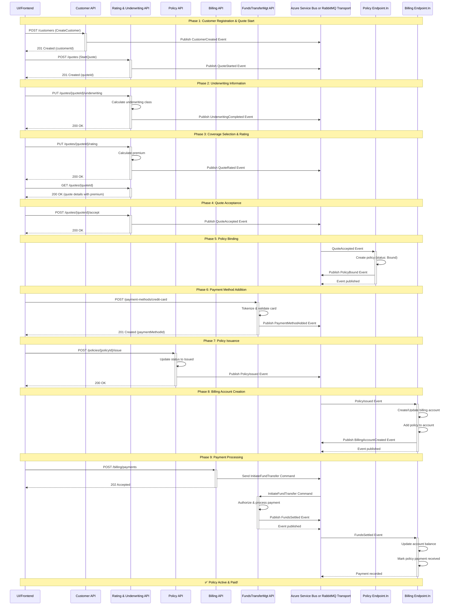

# Quote to Bind Flow - Complete Requirements

**Product**: Kwegibo Property & Casualty Insurance  
**Version**: 1.0.0  
**Date**: February 5, 2026

---

## Executive Summary

This document defines the complete event-driven flow for the Kwegibo insurance quote-to-bind process across six domains: Customer, Rating & Underwriting, Policy, Billing, FundsTransferMgt, and Premium (deferred).

---

## Event-Driven Flow Diagram



**Legend:**
- **Solid arrows (→)**: Synchronous API calls (HTTP requests)
- **Dashed arrows (-->>)**: Synchronous responses
- **Solid arrows to/from ServiceBus**: Asynchronous events/commands over RabbitMQ transport
- **Commands**: Imperative actions (CreateCustomer, InitiateFundTransfer)
- **Events**: Past-tense notifications (CustomerCreated, PolicyIssued)

---

## Domain Aggregate Overview

| Domain | Aggregate Root ID | Partition Key | Purpose |
|--------|------------------|---------------|---------|
| **Customer** | `CustomerId` (GUID) | `/customerId` | Customer identity and contact info |
| **Rating & Underwriting** | `QuoteId` (GUID) | `/quoteId` | Quote, underwriting, and rating calculations |
| **Policy** | `PolicyId` (GUID) | `/policyId` | Policy contracts and lifecycle |
| **Billing** | `BillingAccountId` (GUID) | `/customerId` | Billing accounts (1 per customer, multiple policies) |
| **FundsTransferMgt** | `PaymentMethodId` / `TransferId` | `/customerId` | Payment methods and fund transfers |
| **Premium** _(deferred)_ | `PremiumId` or `PolicyId` | `/policyId` | Written vs earned premium tracking |

---

## Kwegibo Product Definition

### What is a Kwegibo?
A fictional personal property item requiring insurance coverage (similar to electronics, jewelry, or recreational equipment).

### Available Coverages

**Coverage 1: Kwegibo Physical Damage Protection**
- Protects the kwegibo against physical damage, theft, or loss
- Limit Options: $1,000 / $2,500 / $5,000 / $10,000
- Deductible Options: $100 / $250 / $500

**Coverage 2: Kwegibo Liability Protection**
- Covers liability for damages caused by kwegibo use
- Limit Options: $50,000 / $100,000 / $250,000 / $500,000
- No deductible

### Policy Terms
- **Term Length**: 6 months or 12 months
- **Effective Date**: Customer-selected (must be future date within 30 days)
- **Renewal**: Auto-renewal available

---

## Rating & Underwriting Logic

### Underwriting Factors (Determine Class A or B)

**Factor 1: Traffic Accidents**
- Question: "Have you had any traffic violations or accidents in the last 12 months?"
- Options: Yes / No
- Impact: Yes = Class B, No = contributes to Class A

**Factor 2: Education Level**
- Question: "What is your highest level of education?"
- Options: High School / Associate's / Bachelor's / Graduate Degree
- Impact: Bachelor's or Graduate = contributes to Class A

**Factor 3: Kwegibo Experience**
- Question: "How many years have you owned a kwegibo?"
- Options: Less than 1 / 1-3 / 3-5 / 5+ years
- Impact: 3+ years = contributes to Class A

**Classification Rules:**
- **Class A** (Preferred): No accidents + (Bachelor's+ OR 5+ years experience)
- **Class B** (Standard): Everyone else

### Rating Factors (Determine Premium)

**Base Rate by Class:**
- Class A: $150 base rate
- Class B: $250 base rate

**Coverage Selection Multipliers:**
- Physical Damage $1,000: 1.0x
- Physical Damage $2,500: 1.3x
- Physical Damage $5,000: 1.7x
- Physical Damage $10,000: 2.2x
- Liability $50,000: 1.0x
- Liability $100,000: 1.2x
- Liability $250,000: 1.5x
- Liability $500,000: 2.0x

**Term Multiplier:**
- 6 months: 0.55x (10% discount for longer commitment)
- 12 months: 1.0x

**Age Multiplier (from birth date):**
- Under 25: 1.3x
- 25-65: 1.0x
- Over 65: 1.1x

**Territory Multiplier (from zip code):**
- Use first digit:
  - 0-2: 0.9x (low risk)
  - 3-6: 1.0x (medium risk)
  - 7-9: 1.1x (high risk)

**Premium Calculation:**
```
Premium = BaseRate × PhysicalDamageMult × LiabilityMult × TermMult × AgeMult × TerritoryMult
```

**Example:**
- Class A ($150) × Physical $5,000 (1.7x) × Liability $100k (1.2x) × 12 months (1.0x) × Age 30 (1.0x) × Zip 90210 (1.1x)
- = $150 × 1.7 × 1.2 × 1.0 × 1.0 × 1.1 = **$337.80** annual premium

---

## Complete Event-Driven Flow

### Phase 1: Customer Registration & Quote Start

**User Action:** Navigate to website, enter zip code, birth date, email

**API Orchestration:**
1. Generate `CustomerId` (GUID)
2. Generate `QuoteId` (GUID)
3. Send two commands in parallel

**Command 1: CreateCustomer**
- **Target**: Customer Domain API
- **Payload:**
  ```json
  {
    "customerId": "guid",
    "email": "john@example.com",
    "birthDate": "1990-05-15",
    "zipCode": "90210"
  }
  ```

**Command 2: StartQuote**
- **Target**: Rating & Underwriting Domain API
- **Payload:**
  ```json
  {
    "quoteId": "guid",
    "customerId": "guid",
    "zipCode": "90210",
    "birthDate": "1990-05-15"
  }
  ```

**Events Published:**

**Event 1: CustomerCreated**
- **Contract Location**: `services/customer/src/Domain/Contracts/Events/CustomerCreated.cs`
- **Payload:**
  ```json
  {
    "messageId": "guid",
    "occurredUtc": "2026-02-05T10:00:00Z",
    "customerId": "guid",
    "email": "john@example.com",
    "birthDate": "1990-05-15",
    "zipCode": "90210",
    "idempotencyKey": "string"
  }
  ```
- **Subscribers**: None (informational)

**Event 2: QuoteStarted**
- **Contract Location**: `services/ratingandunderwriting/src/Domain/Contracts/Events/QuoteStarted.cs`
- **Payload:**
  ```json
  {
    "messageId": "guid",
    "occurredUtc": "2026-02-05T10:00:00Z",
    "quoteId": "guid",
    "customerId": "guid",
    "zipCode": "90210",
    "birthDate": "1990-05-15",
    "idempotencyKey": "string"
  }
  ```
- **Subscribers**: None

**Result:** UI receives `customerId` and `quoteId` in API responses

---

### Phase 2: Underwriting Information Collection

**User Action:** Answer underwriting questions

**API Call: SubmitUnderwritingInfo**
- **Target**: Rating & Underwriting Domain API
- **Method**: PUT `/api/quotes/{quoteId}/underwriting`
- **Payload:**
  ```json
  {
    "quoteId": "guid",
    "hadTrafficAccidents": false,
    "educationLevel": "Bachelor",
    "yearsOfKwegiboExperience": 5
  }
  ```

**Domain Logic:**
1. Store underwriting responses in Quote document
2. Calculate underwriting class using rules
3. Generate `UnderwritingId` (GUID)
4. Update quote status to "Underwriting Complete"

**Event: UnderwritingCompleted**
- **Contract Location**: `services/ratingandunderwriting/src/Domain/Contracts/Events/UnderwritingCompleted.cs`
- **Payload:**
  ```json
  {
    "messageId": "guid",
    "occurredUtc": "2026-02-05T10:05:00Z",
    "quoteId": "guid",
    "customerId": "guid",
    "underwritingId": "guid",
    "underwritingClass": "ClassA",
    "hadTrafficAccidents": false,
    "educationLevel": "Bachelor",
    "yearsOfExperience": 5,
    "idempotencyKey": "string"
  }
  ```
- **Subscribers**: None (rating uses quote document, not event)

---

### Phase 3: Coverage Selection & Rating

**User Action:** Select coverages and term length

**API Call: CalculateRating**
- **Target**: Rating & Underwriting Domain API
- **Method**: PUT `/api/quotes/{quoteId}/rating`
- **Payload:**
  ```json
  {
    "quoteId": "guid",
    "termLength": 12,
    "physicalDamageCoverage": {
      "selected": true,
      "limit": 5000,
      "deductible": 250
    },
    "liabilityCoverage": {
      "selected": true,
      "limit": 100000
    }
  }
  ```

**Domain Logic:**
1. Retrieve underwriting class from Quote document
2. Calculate premium using rating formula
3. Generate `RatingId` (GUID)
4. Store rating details in Quote document
5. Update quote status to "Rated"

**Event: QuoteRated**
- **Contract Location**: `services/ratingandunderwriting/src/Domain/Contracts/Events/QuoteRated.cs`
- **Payload:**
  ```json
  {
    "messageId": "guid",
    "occurredUtc": "2026-02-05T10:10:00Z",
    "quoteId": "guid",
    "customerId": "guid",
    "ratingId": "guid",
    "underwritingClass": "ClassA",
    "totalPremium": 337.80,
    "termLengthMonths": 12,
    "coverages": [
      {
        "type": "PhysicalDamage",
        "limit": 5000,
        "deductible": 250,
        "premium": 150.00
      },
      {
        "type": "Liability",
        "limit": 100000,
        "premium": 187.80
      }
    ],
    "idempotencyKey": "string"
  }
  ```
- **Subscribers**: None

**UI Behavior:**
- UI polls `GET /api/quotes/{quoteId}` to retrieve rated quote
- Displays premium and coverage summary to customer

---

### Phase 4: Quote Acceptance & Policy Binding

**User Action:** Click "Accept Quote" / "Buy Now"

**API Call: AcceptQuote**
- **Target**: Rating & Underwriting Domain API
- **Method**: POST `/api/quotes/{quoteId}/accept`
- **Payload:**
  ```json
  {
    "quoteId": "guid",
    "effectiveDate": "2026-02-10T00:00:00Z"
  }
  ```

**Domain Logic:**
1. Validate quote is in "Rated" status
2. Update quote status to "Accepted"
3. Store effective date

**Event: QuoteAccepted**
- **Contract Location**: `services/ratingandunderwriting/src/Domain/Contracts/Events/QuoteAccepted.cs`
- **Payload:**
  ```json
  {
    "messageId": "guid",
    "occurredUtc": "2026-02-05T10:15:00Z",
    "quoteId": "guid",
    "customerId": "guid",
    "ratingId": "guid",
    "underwritingId": "guid",
    "totalPremium": 337.80,
    "effectiveDate": "2026-02-10T00:00:00Z",
    "termLengthMonths": 12,
    "idempotencyKey": "string"
  }
  ```
- **Subscribers**: **Policy Domain**

---

### Phase 5: Policy Creation (Bound Status)

**Trigger:** Policy Domain subscribes to `QuoteAccepted` event

**Handler:** `QuoteAcceptedHandler` in Policy Endpoint.In

**Handler Logic:**
1. Generate `PolicyId` (GUID)
2. Create policy document with status "Bound" (not yet issued)
3. Store reference IDs only (quoteId, customerId, ratingId, underwritingId)
4. Store effective date and expiration date (calculated from term)

**Policy Document Structure:**
```json
{
  "id": "policyId-guid",
  "policyId": "policyId-guid",
  "documentType": "Policy",
  "customerId": "guid",
  "quoteId": "guid",
  "ratingId": "guid",
  "underwritingId": "guid",
  "status": "Bound",
  "effectiveDate": "2026-02-10T00:00:00Z",
  "expirationDate": "2027-02-10T00:00:00Z",
  "termLengthMonths": 12,
  "totalPremium": 337.80,
  "createdUtc": "2026-02-05T10:15:05Z",
  "_etag": "string"
}
```

**Event: PolicyBound**
- **Contract Location**: `platform/RiskInsure.PublicContracts/Events/PolicyBound.cs` _(public - used by multiple domains)_
- **Payload:**
  ```json
  {
    "messageId": "guid",
    "occurredUtc": "2026-02-05T10:15:05Z",
    "policyId": "guid",
    "customerId": "guid",
    "quoteId": "guid",
    "status": "Bound",
    "effectiveDate": "2026-02-10T00:00:00Z",
    "expirationDate": "2027-02-10T00:00:00Z",
    "totalPremium": 337.80,
    "idempotencyKey": "string"
  }
  ```
- **Subscribers**: None yet (UI can poll policy status)

**UI Behavior:**
- Display "Your policy is bound! Next step: Set up payment"
- Provide `policyId` to customer
- Allow customer to add payment method

---

### Phase 6: Payment Method Addition

**User Action:** Add credit card or ACH account

**API Call: AddPaymentMethod**
- **Target**: FundsTransferMgt Domain API
- **Method**: POST `/api/payment-methods/credit-card`
- **Payload:**
  ```json
  {
    "paymentMethodId": "guid",
    "customerId": "guid",
    "cardholderName": "John Doe",
    "cardNumber": "4111111111111111",
    "expirationDate": "12/28",
    "cvv": "123",
    "billingAddress": {
      "street": "123 Main St",
      "city": "Beverly Hills",
      "state": "CA",
      "zipCode": "90210"
    }
  }
  ```

**Domain Logic:**
1. Validate and tokenize card
2. Create PaymentMethod document
3. Set as default if first method

**Event: PaymentMethodAdded**
- **Contract Location**: `services/fundstransfermgt/src/Domain/Contracts/Events/PaymentMethodAdded.cs`
- **Payload:**
  ```json
  {
    "messageId": "guid",
    "occurredUtc": "2026-02-05T10:20:00Z",
    "customerId": "guid",
    "paymentMethodId": "guid",
    "methodType": "CreditCard",
    "maskedNumber": "****1111",
    "idempotencyKey": "string"
  }
  ```
- **Subscribers**: None

---

### Phase 7: Policy Issuance & Activation

**User Action:** Click "Activate Policy" / "Complete Purchase"

**API Call: IssuePolicy**
- **Target**: Policy Domain API
- **Method**: POST `/api/policies/{policyId}/issue`
- **Payload:**
  ```json
  {
    "policyId": "guid"
  }
  ```

**Domain Logic:**
1. Verify policy status is "Bound"
2. Verify effective date is valid
3. Update policy status to "Issued"
4. Record issued date

**Event: PolicyIssued**
- **Contract Location**: `platform/RiskInsure.PublicContracts/Events/PolicyIssued.cs` _(public - critical cross-domain event)_
- **Payload:**
  ```json
  {
    "messageId": "guid",
    "occurredUtc": "2026-02-05T10:25:00Z",
    "policyId": "guid",
    "customerId": "guid",
    "quoteId": "guid",
    "status": "Issued",
    "effectiveDate": "2026-02-10T00:00:00Z",
    "expirationDate": "2027-02-10T00:00:00Z",
    "termLengthMonths": 12,
    "totalPremium": 337.80,
    "issuedUtc": "2026-02-05T10:25:00Z",
    "idempotencyKey": "string"
  }
  ```
- **Subscribers**: 
  - **Billing Domain** (create billing account)
  - **Premium Domain** (future - start earning calculation)

---

### Phase 8: Billing Account Creation

**Trigger:** Billing Domain subscribes to `PolicyIssued` event

**Handler:** `PolicyIssuedHandler` in Billing Endpoint.In

**Handler Logic:**
1. Check if customer already has billing account
2. If yes: Add policy to existing account, update premium owed
3. If no: Create new billing account for customer
4. Generate `BillingAccountId` (GUID) if new account
5. Set billing cycle (from customer preference or default to Monthly)
6. Calculate first payment amount based on billing cycle

**Billing Account Document Structure (Multi-Policy Support):**
```json
{
  "id": "billingAccountId-guid",
  "billingAccountId": "billingAccountId-guid",
  "customerId": "guid",
  "documentType": "BillingAccount",
  "policies": [
    {
      "policyId": "guid-1",
      "policyNumber": "KWG-2026-001234",
      "totalPremium": 337.80,
      "paidAmount": 0,
      "outstandingAmount": 337.80,
      "effectiveDate": "2026-02-10T00:00:00Z",
      "expirationDate": "2027-02-10T00:00:00Z",
      "status": "Active",
      "addedUtc": "2026-02-05T10:25:05Z"
    },
    {
      "policyId": "guid-2",
      "policyNumber": "KWG-2026-005678",
      "totalPremium": 450.00,
      "paidAmount": 150.00,
      "outstandingAmount": 300.00,
      "effectiveDate": "2026-03-01T00:00:00Z",
      "expirationDate": "2027-03-01T00:00:00Z",
      "status": "Active",
      "addedUtc": "2026-02-15T14:30:00Z"
    }
  ],
  "status": "Active",
  "billingCycle": "Monthly",
  "accountPremiumOwed": 787.80,
  "accountTotalPaid": 150.00,
  "accountOutstandingBalance": 637.80,
  "createdUtc": "2026-02-05T10:25:05Z",
  "updatedUtc": "2026-02-15T14:30:00Z",
  "_etag": "string"
}
```

**Event: BillingAccountCreated** _(or BillingAccountUpdated if existing)_
- **Contract Location**: `platform/RiskInsure.PublicContracts/Events/BillingAccountCreated.cs`
- **Payload:**
  ```json
  {
    "messageId": "guid",
    "occurredUtc": "2026-02-05T10:25:05Z",
    "billingAccountId": "guid",
    "customerId": "guid",
    "policyId": "guid",
    "totalPremiumOwed": 337.80,
    "billingCycle": "Monthly",
    "firstPaymentDue": "2026-02-10T00:00:00Z",
    "idempotencyKey": "string"
  }
  ```
- **Subscribers**: None (UI can poll billing account)

---

### Phase 9: Initial Payment

**User Action:** Pay now or schedule payment

**API Call: RecordPayment** _(or InitiateFundTransfer)_
- **Target**: Billing Domain API
- **Method**: POST `/api/billing/payments`
- **Payload:**
  ```json
  {
    "billingAccountId": "guid",
    "customerId": "guid",
    "paymentMethodId": "guid",
    "amount": 337.80,
    "paymentDate": "2026-02-05T10:30:00Z"
  }
  ```

**Domain Logic (Billing):**
1. Validate billing account exists
2. Validate amount does not exceed balance
3. Send command to FundsTransferMgt to execute transfer
4. Update billing account when transfer completes

**Command: InitiateFundTransfer**
- **Target**: FundsTransferMgt Domain (via NServiceBus)
- **Contract Location**: `services/fundstransfermgt/src/Domain/Contracts/Commands/InitiateFundTransfer.cs`
- **Payload:**
  ```json
  {
    "messageId": "guid",
    "occurredUtc": "2026-02-05T10:30:00Z",
    "transferId": "guid",
    "customerId": "guid",
    "paymentMethodId": "guid",
    "amount": 337.80,
    "purpose": "PolicyPremiumPayment",
    "policyId": "guid",
    "billingAccountId": "guid",
    "idempotencyKey": "string"
  }
  ```

**Event: FundsSettled** _(from FundsTransferMgt)_
- **Contract Location**: `platform/RiskInsure.PublicContracts/Events/FundsSettled.cs`
- **Payload:**
  ```json
  {
    "messageId": "guid",
    "occurredUtc": "2026-02-05T10:30:15Z",
    "customerId": "guid",
    "transferId": "guid",
    "amount": 337.80,
    "paymentMethodId": "guid",
    "purpose": "PolicyPremiumPayment",
    "policyId": "guid",
  # Phase 8a: Multi-Policy Billing Account Management

**Scenario:** Customer purchases second policy on same billing account

---

#### Requirements Overview

A billing account MUST support multiple policies for the same customer:
- Policies can be added at different times
- Each policy tracks its own premium, payments, and balance
- Account maintains aggregated totals across all policies
- Payments can be allocated to specific policies or distributed proportionally
- Each policy can be in different status (Active, Suspended, Cancelled)

---

#### Data Model: Policy Entry

Each policy in the `policies[]` array contains:

```typescript
{
  policyId: string;              // GUID - link to Policy domain
  policyNumber: string;          // Human-readable (e.g., "KWG-2026-001234")
  totalPremium: number;          // Full term premium for this policy
  paidAmount: number;            // Total paid toward this specific policy
  outstandingAmount: number;     // Remaining balance for this policy
  effectiveDate: string;         // ISO 8601 datetime
  expirationDate: string;        // ISO 8601 datetime
  status: string;                // Active, Suspended, Cancelled, PaidInFull
  addedUtc: string;              // When policy was added to account
  lastPaymentUtc?: string;       // Optional - when last payment applied
  cancellationUtc?: string;      // Optional - when policy cancelled
}
```

**Invariants:**
- `paidAmount + outstandingAmount = totalPremium` (always)
- `status = 'PaidInFull'` when `outstandingAmount = 0`
- Cannot add duplicate policy (same `policyId`)

---

#### Data Model: Account Aggregates

Account-level fields aggregate across ALL policies:

```typescript
{
  accountPremiumOwed: number;        // Sum of all policies' totalPremium
  accountTotalPaid: number;          // Sum of all policies' paidAmount
  accountOutstandingBalance: number; // Sum of all policies' outstandingAmount
}
```

**Calculation Rules:**
```
accountPremiumOwed = SUM(policies[].totalPremium)
accountTotalPaid = SUM(policies[].paidAmount)
accountOutstandingBalance = SUM(policies[].outstandingAmount)

// Alternative (should equal):
accountOutstandingBalance = accountPremiumOwed - accountTotalPaid
```

**Account Status Rules:**
- `Active`: At least one policy active with outstanding balance > 0
- `PaidInFull`: All policies paid in full (outstandingBalance = 0)
- `Suspended`: All policies suspended
- `Closed`: All policies cancelled or expired

---

#### Handler Logic: Adding Policy to Existing Account

**Event Handler:** `PolicyIssuedHandler` in Billing Endpoint.In

**Flow:**
1. Receive `PolicyIssued` event
2. Query: Does billing account exist for this `customerId`?
3. **If NO account exists:**
   - Create new billing account (current behavior)
   - Add policy as first entry in `policies[]` array
   - Set account aggregates = policy values
   - Publish `BillingAccountCreated` event

4. **If account EXISTS:**
   - Retrieve account document
   - Check if policy already added (idempotency)
   - If policy exists, skip (log and return)
   - If new policy:
     - Add to `policies[]` array
     - Recalculate account aggregates:
       ```
       accountPremiumOwed += policy.totalPremium
       accountOutstandingBalance += policy.totalPremium
       ```
     - Update account status if needed
     - Use ETag for optimistic concurrency
     - Save account document
     - Publish `PolicyAddedToBillingAccount` event

**Code Example:**
```csharp
public async Task Handle(PolicyIssued message, IMessageHandlerContext context)
{
    // Get or create billing account
    var account = await _repository.GetByCustomerIdAsync(message.CustomerId);
    
    if (account == null)
    {
        // Create new account with first policy
        account = new BillingAccount
        {
            BillingAccountId = Guid.NewGuid(),
            CustomerId = message.CustomerId,
            Policies = new List<PolicyEntry>
            {
                new PolicyEntry
                {
                    PolicyId = message.PolicyId,
                    Policymultiple policies per customer  
✅ Payment allocation to specific policies  
✅ Account aggregates calculated correctly across all policies
                    TotalPremium = message.TotalPremium,
                    PaidAmount = 0,
                    OutstandingAmount = message.TotalPremium,
                    EffectiveDate = message.EffectiveDate,
                    ExpirationDate = message.ExpirationDate,
                    Status = "Active",
                    AddedUtc = DateTimeOffset.UtcNow
                }
            },
            Status = "Active",
            BillingCycle = "Monthly",
            AccountPremiumOwed = message.TotalPremium,
            AccountTotalPaid = 0,
            AccountOutstandingBalance = message.TotalPremium
        };
        
        await _repository.CreateAsync(account);
        await context.Publish(new BillingAccountCreated(...));
    }
    else
    {
        // Check if policy already added (idempotency)
        if (account.Policies.Any(p => p.PolicyId == message.PolicyId))
        {
            _logger.LogInformation(
                "Policy {PolicyId} already on account {AccountId}, skipping",
                message.PolicyId, account.BillingAccountId);
            return;
        }
        
        // Add policy to existing account
        account.Policies.Add(new PolicyEntry
        {
            PolicyId = message.PolicyId,
            PolicyNumber = GeneratePolicyNumber(),
            TotalPremium = message.TotalPremium,
            PaidAmount = 0,
            OutstandingAmount = message.TotalPremium,
            EffectiveDate = message.EffectiveDate,
            ExpirationDate = message.ExpirationDate,
            Status = "Active",
            AddedUtc = DateTimeOffset.UtcNow
        });
        
        // Recalculate aggregates
        account.AccountPremiumOwed = account.Policies.Sum(p => p.TotalPremium);
        account.AccountTotalPaid = account.Policies.Sum(p => p.PaidAmount);
        account.AccountOutstandingBalance = account.Policies.Sum(p => p.OutstandingAmount);
        
        await _repository.UpdateAsync(account);
        await context.Publish(new PolicyAddedToBillingAccount(...));
    }
}
```

---

#### Payment Allocation Strategies

When a payment is made on an account with multiple policies, determine how to allocate:

**Strategy 1: Specific Policy Payment (Targeted)**
- UI/API specifies which policy to pay
- Payment applied 100% to that policy
- Other policies unaffected

**API Payload:**
```json
{
  "billingAccountId": "guid",
  "policyId": "guid",  // OPTIONAL - if specified, target this policy
  "paymentMethodId": "guid",
  "amount": 100.00
}
```

**Strategy 2: Proportional Distribution (Default)**
- If no `policyId` specified, distribute across all active policies
- Allocate proportionally based on outstanding balances
- Pay off smaller balances first (optional variation)

**Allocation Formula (Proportional):**
```
For each policy:
  allocationAmount = (policy.outstandingAmount / accountOutstandingBalance) × paymentAmount
  policy.paidAmount += allocationAmount
  policy.outstandingAmount -= allocationAmount
```

**Example:**
```
Account has 2 policies:
- Policy A: $300 outstanding
- Policy B: $600 outstanding
- Total: $900 outstanding

Payment: $450

Policy A gets: ($300 / $900) × $450 = $150
Policy B gets: ($600 / $900) × $450 = $300

Result:
- Policy A: $150 outstanding (paid in full if this equals total)
- Policy B: $300 outstanding
```

**Strategy 3: Oldest Policy First (FIFO)**
- Pay oldest policy (earliest `addedUtc`) first
- Apply full payment until policy paid off
- Move to next policy if payment exceeds balance

**Recommendation:** Start with **Strategy 1 (Targeted)** for MVP. Add Strategy 2 later if needed.

---

#### Payment Handler Logic (Multi-Policy)

**Handler:** `RecordPaymentHandler` in Billing Domain

```csharp
public async Task RecordPayment(RecordPaymentRequest request)
{
    var account = await _repository.GetByIdAsync(request.BillingAccountId);
    
    // Validate payment amount
    if (request.Amount <= 0)
        throw new ValidationException("Amount must be positive");
    
    if (request.Amount > account.AccountOutstandingBalance)
        throw new ValidationException("Payment exceeds outstanding balance");
    
    // Strategy 1: Targeted payment to specific policy
    if (request.PolicyId.HasValue)
    {
        var policy = account.Policies.FirstOrDefault(p => p.PolicyId == request.PolicyId.Value);
        if (policy == null)
            throw new NotFoundException($"Policy {request.PolicyId} not found on account");
        
        if (request.Amount > policy.OutstandingAmount)
            throw new ValidationException("Payment exceeds policy balance");
        
        // Apply payment to specific policy
        policy.PaidAmount += request.Amount;
        policy.OutstandingAmount -= request.Amount;
        policy.LastPaymentUtc = DateTimeOffset.UtcNow;
        
        if (policy.OutstandingAmount == 0)
            policy.Status = "PaidInFull";
    }
    else
    {
        // Strategy 2: Proportional distribution (future)
        // For now, require policyId
        throw new ValidationException("PolicyId required for payment");
    }
    
    // Recalculate account aggregates
    account.AccountTotalPaid = account.Policies.Sum(p => p.PaidAmount);
    account.AccountOutstandingBalance = account.Policies.Sum(p => p.OutstandingAmount);
    
    // Update account status
    if (account.AccountOutstandingBalance == 0)
        account.Status = "PaidInFull";
    
    // Initiate fund transfer
    await _messagingSession.Send(new InitiateFundTransfer
    {
        TransferId = Guid.NewGuid(),
        CustomerId = account.CustomerId,
        PaymentMethodId = request.PaymentMethodId,
        Amount = request.Amount,
        Purpose = "PolicyPremiumPayment",
        PolicyId = request.PolicyId,
        BillingAccountId = account.BillingAccountId
    });
    
    await _repository.UpdateAsync(account);
}
```

---

#### Events for Multi-Policy Billing

**Event: PolicyAddedToBillingAccount**
- **Contract Location**: `platform/RiskInsure.PublicContracts/Events/PolicyAddedToBillingAccount.cs`
- **Payload:**
  ```json
  {
    "messageId": "guid",
    "occurredUtc": "2026-02-15T14:30:00Z",
    "billingAccountId": "guid",
    "customerId": "guid",
    "policyId": "guid",
    "policyNumber": "KWG-2026-005678",
    "policyPremium": 450.00,
    "accountPremiumOwed": 787.80,
    "accountOutstandingBalance": 637.80,
    "policyCount": 2,
    "idempotencyKey": "string"
  }
  ```
- **Subscribers**: None (informational)

**Event: PaymentAllocated** (optional enhancement)
- Published when payment distributed across multiple policies
- Shows breakdown of allocation per policy

---

#### APIs for Multi-Policy Billing

**POST /api/billing/payments** (Updated)
- Add optional `policyId` field to target specific policy
- Request:
  ```json
  {
    "billingAccountId": "guid",
    "customerId": "guid",
    "policyId": "guid",  // OPTIONAL - if provided, apply to this policy only
    "paymentMethodId": "guid",
    "amount": 100.00,
    "paymentDate": "2026-02-05T10:30:00Z"
  }
  ```

**GET /api/billing/accounts/{billingAccountId}/policies**
- List all policies on the billing account
- Response:
  ```json
  {
    "billingAccountId": "guid",
    "customerId": "guid",
    "policies": [
      {
        "policyId": "guid",
        "policyNumber": "KWG-2026-001234",
        "totalPremium": 337.80,
        "paidAmount": 337.80,
        "outstandingAmount": 0,
        "status": "PaidInFull",
        "effectiveDate": "2026-02-10T00:00:00Z",
        "expirationDate": "2027-02-10T00:00:00Z"
      }
    ],
    "accountTotals": {
      "premiumOwed": 787.80,
      "totalPaid": 487.80,
      "outstandingBalance": 300.00
    }
  }
  ```

**GET /api/billing/accounts/{billingAccountId}/policies/{policyId}/payments**
- List all payments applied to a specific policy
- Shows payment history for policy-level reconciliation

**POST /api/billing/accounts/{billingAccountId}/policies/{policyId}/remove**
- Remove policy from account (if cancelled, refunds issued, etc.)
- Recalculate account aggregates
- Publish `PolicyRemovedFromBillingAccount` event

---

#### Consistency & Validation Rules

**Adding Policy:**
1. ✅ Policy must exist in Policy domain (validate via PolicyId)
2. ✅ Policy CustomerId must match BillingAccount CustomerId
3. ✅ Policy cannot already exist on another billing account (1 policy = 1 account)
4. ✅ Cannot add duplicate policy to same account (idempotency check)

**Recording Payment:**
1. ✅ Payment amount must be > 0
2. ✅ Payment amount must not exceed account outstanding balance
3. ✅ If `policyId` specified, amount must not exceed policy outstanding balance
4. ✅ PolicyId (if provided) must exist on the account

**Account Aggregates:**
1. ✅ After every operation, recalculate all aggregates
2. ✅ Use optimistic concurrency (ETags) to prevent lost updates
3. ✅ Log before/after values for audit trail

**Status Transitions:**
- Account starts as "Active"
- Account becomes "PaidInFull" when all policies paid
- Account becomes "Suspended" if any policy suspended and balance > 0
- Account becomes "Closed" when all policies cancelled/expired

---

#### Example: Second Policy Purchase Flow

**Timeline:**
1. Customer buys Policy 1 (KWG-2026-001234) for $337.80 on Feb 5
2. Billing account created, balance = $337.80
3. Customer pays $337.80 on Feb 5
4. Policy 1 marked "PaidInFull", account balance = $0
5. **Customer buys Policy 2 (KWG-2026-005678) for $450.00 on Feb 15**
6. `PolicyIssued` event fires for Policy 2
7. Billing handler finds existing account for customer
8. Adds Policy 2 to `policies[]` array
9. Recalculates: `accountPremiumOwed = $787.80`, `accountOutstandingBalance = $450.00`
10. Publishes `PolicyAddedToBillingAccount` event
11. Customer makes $150 payment toward Policy 2
12. Account shows: Policy 1 (paid), Policy 2 ($300 remaining)

**Cosmos Document After Step 12:**
```json
{
  "id": "billing-account-guid",
  "billingAccountId": "billing-account-guid",
  "customerId": "customer-guid",
  "documentType": "BillingAccount",
  "policies": [
    {
      "policyId": "policy1-guid",
      "policyNumber": "KWG-2026-001234",
      "totalPremium": 337.80,
      "paidAmount": 337.80,
      "outstandingAmount": 0,
      "status": "PaidInFull",
      "effectiveDate": "2026-02-10T00:00:00Z",
      "expirationDate": "2027-02-10T00:00:00Z",
      "addedUtc": "2026-02-05T10:25:05Z",
      "lastPaymentUtc": "2026-02-05T10:30:00Z"
    },
    {
      "policyId": "policy2-guid",
      "policyNumber": "KWG-2026-005678",
      "totalPremium": 450.00,
      "paidAmount": 150.00,
      "outstandingAmount": 300.00,
      "status": "Active",
      "effectiveDate": "2026-03-01T00:00:00Z",
      "expirationDate": "2027-03-01T00:00:00Z",
      "addedUtc": "2026-02-15T14:30:00Z",
      "lastPaymentUtc": "2026-02-15T15:00:00Z"
    }
  ],
  "status": "Active",
  "billingCycle": "Monthly",
  "accountPremiumOwed": 787.80,
  "accountTotalPaid": 487.80,
  "accountOutstandingBalance": 300.00,
  "createdUtc": "2026-02-05T10:25:05Z",
  "updatedUtc": "2026-02-15T15:00:00Z",
  "_etag": "12345-etag-value"
}
```

---

#### Testing Requirements

**Unit Tests:**
- ✅ Add first policy to new account
- ✅ Add second policy to existing account
- ✅ Idempotency: Adding same policy twice has no effect
- ✅ Aggregate calculations correct after adding policies
- ✅ Payment allocation to specific policy
- ✅ Aggregate recalculation after payment
- ✅ Status transitions (Active → PaidInFull)

**Integration Tests:**
- ✅ Complete multi-policy flow (buy 2 policies, make payments)
- ✅ Concurrent policy additions (race conditions with ETags)
- ✅ Payment exceeding balance (validation)
- ✅ Payment to non-existent policy (validation)

---

##  "settledUtc": "2026-02-05T10:30:15Z",
    "idempotencyKey": "string"
  }
  ```
- **Subscribers**: 
  - **Billing Domain** (update account, mark payment received)

**Billing Handler Logic:**
1. Update billing account: `totalPaid += amount`, `outstandingBalance -= amount`
2. If balance = 0, mark account as "Paid in Full"
3. Publish `PaymentReceived` event (if needed for other domains)

**Result:** Policy is now fully paid and active!

---

## Additional APIs Required

### Customer Domain

**GET /api/customers/{customerId}**
- Retrieve customer details

**PUT /api/customers/{customerId}**
- Update customer information (address, email, phone)

### Rating & Underwriting Domain

**GET /api/quotes/{quoteId}**
- Retrieve quote status and details

**GET /api/quotes?customerId={customerId}**
- List all quotes for customer

**DELETE /api/quotes/{quoteId}**
- Delete/abandon a quote

### Policy Domain

**GET /api/policies/{policyId}**
- Retrieve policy details (ID references only)

**GET /api/policies/{policyId}/full**
- Retrieve complete policy view (aggregates data from multiple domains)

**GET /api/policies?customerId={customerId}**
- List all policies for customer

**POST /api/policies/{policyId}/cancel**
- Cancel policy (future)

### Billing Domain

**GET /api/billing/accounts/{billingAccountId}**
- Retrieve billing account details

**GET /api/billing/accounts?customerId={customerId}**
- Get customer's billing account

**GET /api/billing/accounts/{billingAccountId}/invoices**
- List invoices for account

---

## Data Consistency & Integration Patterns

### Quote to Bind Orchestration

**Choreography Pattern** (Event-Driven):
- Each domain publishes events
- Other domains subscribe and react
- No central orchestrator
- Loose coupling

**Key Integration Points:**
1. **Quote Accepted** → Policy creates bound policy
2. **Policy Issued** → Billing creates/updates account
3. **Policy Issued** → Premium starts earning calculation (future)
4. **Funds Settled** → Billing updates payment status

### Full Policy View Aggregation

Since Policy stores only IDs, the "full policy view" API must:
1. Read Policy document (IDs, dates, premium)
2. Call Rating & Underwriting API: GET `/api/quotes/{quoteId}` (coverages, rating details)
3. Call Customer API: GET `/api/customers/{customerId}` (name, address)
4. Aggregate into single response

**Recommendation:** Implement as a read-side projection or use BFF (Backend for Frontend) pattern.

---

## Future Enhancements (Out of Scope for MVP)

### Premium Domain
- Subscribe to `PolicyIssued` event
- Calculate earned premium daily based on policy effective date
- Track written vs earned premium for accounting
- Handle mid-term adjustments from endorsements

### Billing Multi-Policy Support (INCLUDED IN MVP)
See detailed requirements in "Phase 8a: Multi-Policy Billing Account Management" section below.

### Quote Enhancements
- Quote expiration (30-day TTL)
- Quote versioning (track changes over time)
- Save and resume quotes (partial completion)

### Policy Enhancements
- Endorsements (mid-term changes)
- Renewals
- Cancellations with refund calculation
- Policy documents/ID card generation

---

## Success Criteria

✅ Customer can complete quote-to-bind flow end-to-end  
✅ All domains communicate via events (no direct dependencies)  
✅ Quote can be abandoned and resumed  
✅ Multiple quotes per customer supported  
✅ Billing account handles single policy (multiple policies = TODO)  
✅ Payment method added and payment processed  
✅ Policy issued and active  
✅ All events properly correlated with IDs  

---

## Next Steps

1. **Create Business Requirements** for each domain (in `docs/business/` folders)
2. **Create Technical Specifications** for each domain (in `docs/technical/` folders)
3. **Define Message Contracts** (commands and events as C# records)
4. **Implement Domain Projects** (Api, Domain, Infrastructure, Endpoint.In)
5. **Create Integration Tests** (Playwright for APIs, xUnit for handlers)

