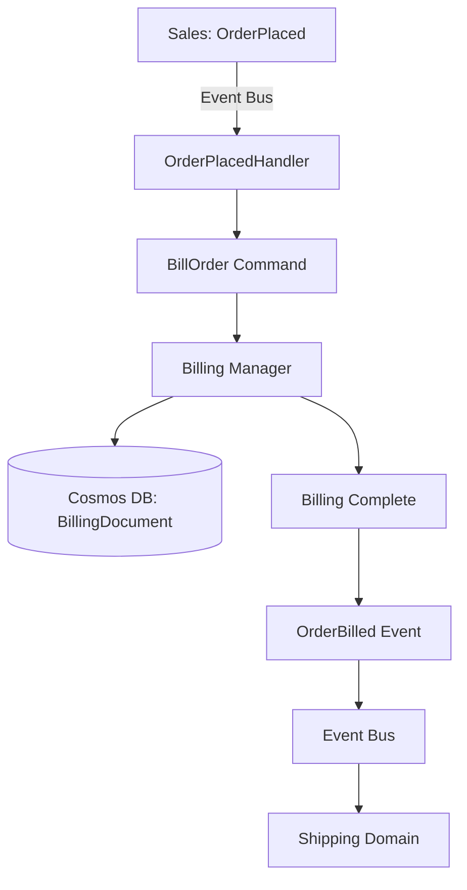

# Billing Domain Overview

## Bounded Context
This domain implements the **Billing** capability within the RiskInsure system.

**Context Boundary**:
- **IN SCOPE**: 
  - Process billing for placed orders
  - Charging credit card / payment processing
  - Publishing order billed confirmation
- **OUT OF SCOPE**: 
  - Order placement (handled by Sales domain)
  - Shipping and fulfillment (handled by Shipping domain)
  - Payment method management

## Core Responsibilities
1. **Order Billing**: Process payments for orders when OrderPlaced events are received
2. **Payment Processing**: Charge credit cards or process payments
3. **Event Publishing**: Publish OrderBilled events to notify shipping system

## Core Entities
- **Billing**: Primary entity representing a billing record/transaction for an order

## Domain Events Published

| Event Name | Trigger | Data Elements | Consumers |
|------------|---------|---------------|-----------|
| `OrderBilled` | Order successfully billed/charged | OrderID (GUID) | Shipping (for order fulfillment) |

## Domain Events Subscribed

| Event Name | Source Context | Handler | Triggered Command |
|------------|----------------|---------|-------------------|
| `OrderPlaced` | Sales | OrderPlacedHandler | `BillOrder` |

## Integration Points
- **Upstream Dependencies**: Sales domain (subscribes to OrderPlaced)
- **Downstream Consumers**: Shipping domain (subscribes to OrderBilled)

## Event Flow

---
*Generated from DDD specification - Billing processes orders after placement*
