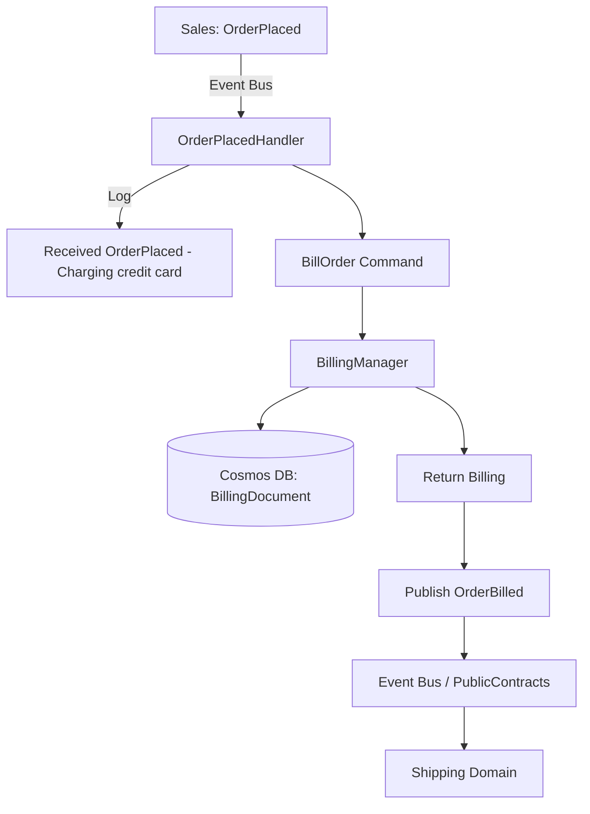

# Billing - Technical Specification

## Architecture

### Layer Structure
```
Billing/
├── src/
│   ├── Api/              # HTTP endpoints (NOT NEEDED - message-driven)
│   ├── Domain/           # Business logic, contracts, managers
│   ├── Infrastructure/   # Cosmos DB, NServiceBus config
│   └── Endpoint.In/      # Message handlers (OrderPlacedHandler)
└── test/
    ├── Unit.Tests/       # Domain & manager tests
    └── Integration.Tests/ # Message handler tests
```

### Technology Stack
- **.NET**: 10.0
- **NServiceBus**: 9.2.6
- **Cosmos DB**: Single-partition strategy
- **Azure Service Bus**: Message transport
- **xUnit**: Unit testing
- **Playwright**: Integration testing

---

## API Endpoints

**This domain is message-driven only** - no public HTTP API.
All operations triggered via subscribed events from Sales domain.

- **Endpoint.In**: Background NServiceBus host processes OrderPlaced events

---

## Data Model

### Cosmos DB Container
- **Container Name**: `nsbbilling`
- **Partition Key**: `/orderId`
- **Documents**:
  - BillingDocument

### BillingDocument

```csharp
public class BillingDocument
{
    [JsonPropertyName("id")]
    public string Id { get; set; }  // GUID (billing record ID)
    
    [JsonPropertyName("orderId")]
    public Guid OrderId { get; set; }  // Partition key (correlation ID)
    
    [JsonPropertyName("type")]
    public string Type { get; set; } = "Billing";
    
    [JsonPropertyName("status")]
    public string Status { get; set; }  // "Charged", "Failed"
    
    [JsonPropertyName("chargedAt")]
    public DateTimeOffset ChargedAt { get; set; }
    
    [JsonPropertyName("createdAt")]
    public DateTimeOffset CreatedAt { get; set; }
    
    [JsonPropertyName("updatedAt")]
    public DateTimeOffset UpdatedAt { get; set; }
    
    [JsonPropertyName("_etag")]
    public string? ETag { get; set; }
}
```

---

## Message Contracts

### Commands (Internal)
*Commands this domain processes*

#### BillOrder
```csharp
namespace RiskInsure.Billing.Domain.Contracts.Commands;

public record BillOrder(
    Guid MessageId,
    DateTimeOffset OccurredUtc,
    Guid OrderId,
    string IdempotencyKey
);
```

### Events Published (Public Contracts)
*Events published to other domains - place in PublicContracts project*

#### OrderBilled
```csharp
namespace RiskInsure.PublicContracts.Events;

public record OrderBilled(
    Guid MessageId,
    DateTimeOffset OccurredUtc,
    Guid OrderId,
    string IdempotencyKey
);
```

### Events Subscribed
*Events this domain listens to from other domains*

- **`OrderPlaced`**: From `Sales` domain
  - Namespace: `RiskInsure.PublicContracts.Events.OrderPlaced`

---

## Domain Logic

### Managers

#### BillingManager
**Responsibilities**:
- Execute BillingOrder business logic
- Process payments (charge credit card)
- Create billing records

**Methods**:
```csharp
/// <summary>
/// Bill an order - intuitive logic to process payment
/// </summary>
Task<BillingDocument> BillOrderAsync(BillOrder command);
```

**Business Logic**:
- **`BillOrderAsync`**:
  1. Validate OrderId is provided
  2. Check for duplicate billing record (idempotency)
  3. Process payment (charge credit card - simulated or actual)
  4. Create BillingDocument with status "Charged"
  5. Save to Cosmos DB
  6. Return result for event publishing

---

## Message Handlers

### Handlers in Endpoint.In

#### OrderPlacedHandler
**Message**: `OrderPlaced` from `Sales` domain  
**Purpose**: MustBillOnOrderPlaced - Process billing when order is placed  
**Policy**: OnOrderPlaced

**Processing Logic**:
1. Receive `OrderPlaced` event
2. Log: "Received OrderPlaced, OrderId = {OrderID} - Charging credit card..."
3. Call `BillingManager.BillOrderAsync()`
4. Publish `OrderBilled` event

**Handler Implementation**:
```csharp
public class OrderPlacedHandler : IHandleMessages<OrderPlaced>
{
    private readonly BillingManager _manager;
    private readonly ILogger<OrderPlacedHandler> _logger;

    public async Task Handle(OrderPlaced message, IMessageHandlerContext context)
    {
        _logger.LogInformation(
            "Received OrderPlaced, OrderId = {OrderID} - Charging credit card...",
            message.OrderId);

        // Call domain manager
        var billing = await _manager.BillOrderAsync(
            new BillOrder(
                MessageId: Guid.NewGuid(),
                OccurredUtc: DateTimeOffset.UtcNow,
                OrderId: message.OrderId,
                IdempotencyKey: $"BillOrder-{message.OrderId}"
            ));

        _logger.LogInformation(
            "Publishing OrderBilled for OrderId = {OrderID}",
            message.OrderId);

        // Publish resulting event
        await context.Publish(new OrderBilled(
            MessageId: Guid.NewGuid(),
            OccurredUtc: DateTimeOffset.UtcNow,
            OrderId: billing.OrderId,
            IdempotencyKey: billing.IdempotencyKey
        ));
    }
}
```

---

## NServiceBus Configuration

### Endpoint Configuration
```csharp
var endpointConfiguration = new EndpointConfiguration("RiskInsure.Billing.Endpoint");

// Configure routing
var routing = endpointConfiguration.UseTransport<AzureServiceBusTransport>();

// Subscribe to Sales.OrderPlaced event
routing.RouteToEndpoint(typeof(OrderPlaced), "RiskInsure.Sales.Endpoint");
```

---

## Validation Rules
**Minimal validation approach**:
- Required fields: OrderId must be present
- Format validation: OrderId must be valid GUID
- Business rules: Process each order exactly once (idempotency check)

---

## Error Handling
- **Validation errors**: Log and dead-letter message
- **Payment failures**: Retry with exponential backoff
- **Business rule violations**: Log and potentially publish failure event
- **Idempotency**: Check for existing billing record before processing
- **Retry logic**: NServiceBus default retry policies

---

## Testing Strategy

### Unit Tests
- BillingManager.BillOrderAsync logic
- Validation logic
- Idempotency checks

### Integration Tests
- Message handler testing (OrderPlacedHandler)
- Event → Command → Event flow
- Verify OrderBilled event published
- Idempotency verification (duplicate events)
- Error scenario handling

---

## Event Flow Diagram



---

*Generated from DDD specification: Billing_Systems_single_context_final.md*
