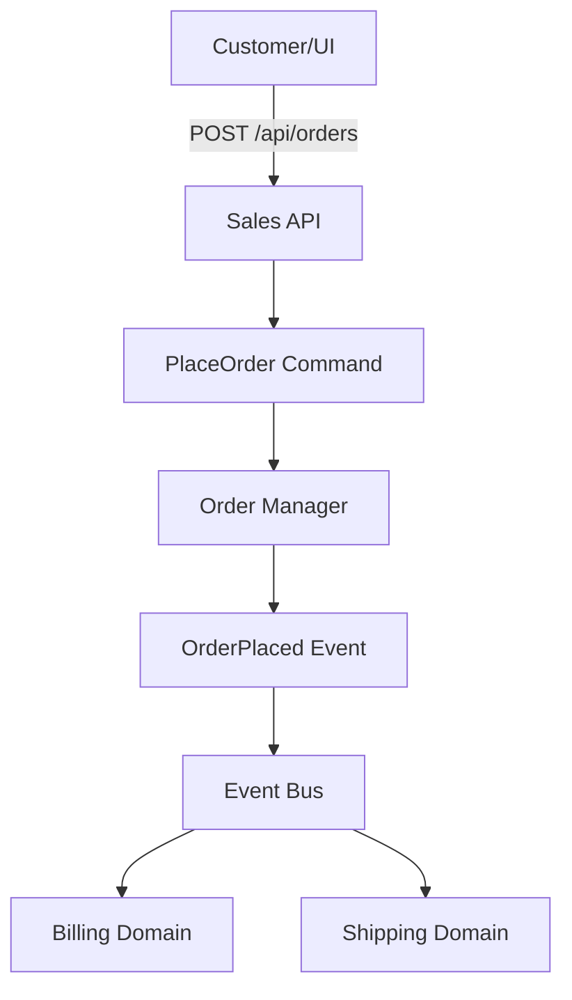

# Sales Domain Overview

## Bounded Context
This domain implements the **Sales** capability within the RiskInsure system.

**Context Boundary**:
- **IN SCOPE**: 
  - Customer order placement
  - Order validation and acceptance
  - Publishing order events to downstream systems
- **OUT OF SCOPE**: 
  - Billing/payment processing (handled by Billing domain)
  - Inventory management and shipping (handled by Shipping domain)
  - Order fulfillment tracking

## Core Responsibilities
1. **Order Placement**: Accept and validate customer orders through user interface
2. **Event Publishing**: Publish OrderPlaced events to initiate downstream processing
3. **Order Management**: Track order lifecycle from placement to handoff

## Core Entities
- **Order**: Primary entity representing a customer order with unique OrderID

## Domain Events Published

| Event Name | Trigger | Data Elements | Consumers |
|------------|---------|---------------|-----------|
| `OrderPlaced` | Customer successfully places order | OrderID (GUID) | Billing (for payment), Shipping (for inventory reservation) |

## Domain Events Subscribed

This domain does not subscribe to external events - it serves as the entry point for the order processing workflow.

## Integration Points
- **Upstream Dependencies**: None (entry point)
- **Downstream Consumers**: 
  - Billing domain (subscribes to OrderPlaced)
  - Shipping domain (subscribes to OrderPlaced)

## Event Flow

---
*Generated from DDD specification - Sales is the orchestration entry point*
