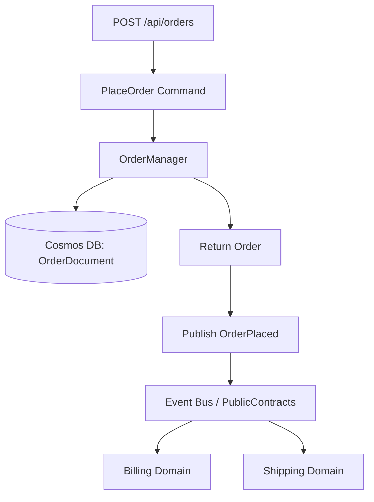

# Sales - Technical Specification

## Architecture

### Layer Structure
```
Sales/
├── src/
│   ├── Api/              # HTTP endpoints (Port: TBD)
│   ├── Domain/           # Business logic, contracts, managers
│   ├── Infrastructure/   # Cosmos DB, NServiceBus config
│   └── Endpoint.In/      # Message handlers (not needed - no subscriptions)
└── test/
    ├── Unit.Tests/       # Domain & manager tests
    └── Integration.Tests/ # Playwright API tests
```

### Technology Stack
- **.NET**: 10.0
- **NServiceBus**: 9.2.6 (send-only for API)
- **Cosmos DB**: Single-partition strategy
- **Azure Service Bus**: Message transport
- **xUnit**: Unit testing
- **Playwright**: Integration testing

---

## API Endpoints

### Port Assignment
- **API**: `http://localhost:TBD` (will be assigned during implementation)
- **Endpoint.In**: Not needed (no external subscriptions)

### Orders Controller

#### POST /api/orders
**Purpose**: Place a new order  
**Command**: `PlaceOrder`

**Request**:
```json
{
  "orderId": "3fa85f64-5717-4562-b3fc-2c963f66afa6"
}
```

**Response**:
```json
{
  "success": true,
  "orderId": "3fa85f64-5717-4562-b3fc-2c963f66afa6",
  "eventPublished": "OrderPlaced",
  "placedAt": "2026-02-07T10:30:00Z"
}
```

**Events Published**:
- `OrderPlaced` (OrderID: Guid)

**Error Responses**:
- `400 Bad Request`: Invalid OrderID format
- `409 Conflict`: Duplicate OrderID already exists
- `422 Unprocessable Entity`: Business rule violations
- `500 Internal Server Error`: Unexpected error

---

## Data Model

### Cosmos DB Container
- **Container Name**: `nsbsales`
- **Partition Key**: `/orderId`
- **Documents**:
  - OrderDocument

### OrderDocument

```csharp
public class OrderDocument
{
    [JsonPropertyName("id")]
    public string Id { get; set; }  // Same as OrderId
    
    [JsonPropertyName("orderId")]
    public Guid OrderId { get; set; }  // Partition key
    
    [JsonPropertyName("type")]
    public string Type { get; set; } = "Order";
    
    [JsonPropertyName("status")]
    public string Status { get; set; }  // "Placed"
    
    [JsonPropertyName("placedAt")]
    public DateTimeOffset PlacedAt { get; set; }
    
    [JsonPropertyName("createdAt")]
    public DateTimeOffset CreatedAt { get; set; }
    
    [JsonPropertyName("updatedAt")]
    public DateTimeOffset UpdatedAt { get; set; }
    
    [JsonPropertyName("_etag")]
    public string? ETag { get; set; }
}
```

---

## Message Contracts

### Commands (Internal)
*Commands this domain processes*

#### PlaceOrder
```csharp
namespace RiskInsure.Sales.Domain.Contracts.Commands;

public record PlaceOrder(
    Guid MessageId,
    DateTimeOffset OccurredUtc,
    Guid OrderId,
    string IdempotencyKey
);
```

### Events Published (Public Contracts)
*Events published to other domains - place in PublicContracts project*

#### OrderPlaced
```csharp
namespace RiskInsure.PublicContracts.Events;

public record OrderPlaced(
    Guid MessageId,
    DateTimeOffset OccurredUtc,
    Guid OrderId,
    string IdempotencyKey
);
```

### Events Subscribed
*This domain does not subscribe to external events*

---

## Domain Logic

### Managers

#### OrderManager
**Responsibilities**:
- Execute PlacingOrder business logic
- Validate order data
- Create order records

**Methods**:
```csharp
/// <summary>
/// Place a new order - intuitive logic to accept and validate order
/// </summary>
Task<OrderDocument> PlaceOrderAsync(PlaceOrder command);
```

**Business Logic**:
- **`PlaceOrderAsync`**:
  1. Validate OrderId is provided and valid GUID
  2. Check for duplicate OrderId in database (idempotency)
  3. Create OrderDocument with status "Placed"
  4. Save to Cosmos DB
  5. Return result for event publishing

---

## Message Handlers

**This domain does not subscribe to external events** - no message handlers required in Endpoint.In.

The API layer uses NServiceBus in **send-only mode** to publish events.

---

## API Implementation Pattern

### OrdersController
```csharp
[ApiController]
[Route("api/orders")]
public class OrdersController : ControllerBase
{
    private readonly OrderManager _manager;
    private readonly IMessageSession _messageSession;

    [HttpPost]
    public async Task<IActionResult> PlaceOrder([FromBody] PlaceOrderRequest request)
    {
        // Call manager
        var order = await _manager.PlaceOrderAsync(
            new PlaceOrder(
                MessageId: Guid.NewGuid(),
                OccurredUtc: DateTimeOffset.UtcNow,
                OrderId: request.OrderId,
                IdempotencyKey: $"PlaceOrder-{request.OrderId}"
            ));

        // Publish event
        await _messageSession.Publish(new OrderPlaced(
            MessageId: Guid.NewGuid(),
            OccurredUtc: DateTimeOffset.UtcNow,
            OrderId: order.OrderId,
            IdempotencyKey: order.IdempotencyKey
        ));

        return Ok(new {
            Success = true,
            OrderId = order.OrderId,
            EventPublished = "OrderPlaced",
            PlacedAt = order.PlacedAt
        });
    }
}
```

---

## Validation Rules
**Minimal validation approach**:
- Required fields: OrderId must be present
- Format validation: OrderId must be valid GUID
- Business rules: OrderId must be unique (check database)

---

## Error Handling
- **Validation errors**: Return 400 Bad Request
- **Duplicate OrderId**: Return 409 Conflict
- **Business rule violations**: Return 422 Unprocessable Entity
- **Idempotency**: Check for existing Order with same OrderId before creating

---

## Testing Strategy

### Unit Tests
- OrderManager.PlaceOrderAsync logic
- Validation logic (required fields, GUID format)
- Idempotency checks

### Integration Tests
- API endpoint testing (Playwright)
- POST /api/orders with valid OrderId
- Duplicate OrderId handling (409 Conflict)
- Invalid OrderId format (400 Bad Request)
- Verify OrderPlaced event published

---

## Event Flow Diagram



---

*Generated from DDD specification: Sales_Systems_single_context_final.md*
