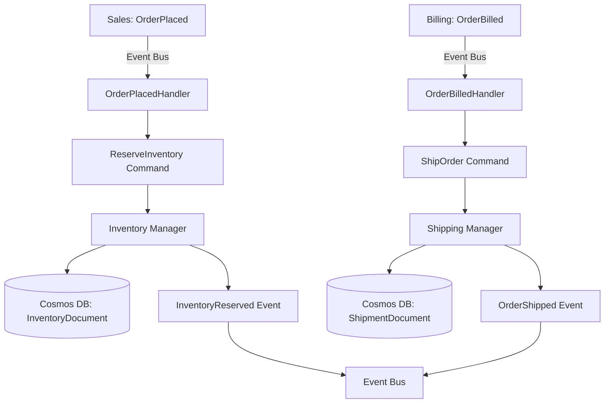

# Shipping Domain Overview

## Bounded Context
This domain implements the **Shipping** capability within the RiskInsure system.

**Context Boundary**:
- **IN SCOPE**: 
  - Inventory reservation for placed orders
  - Order packaging and preparation
  - Order shipping and fulfillment
  - Publishing shipment events
- **OUT OF SCOPE**: 
  - Order placement (handled by Sales domain)
  - Payment processing (handled by Billing domain)
  - Inventory replenishment

## Core Responsibilities
1. **Inventory Reservation**: Reserve inventory when orders are placed
2. **Order Packaging**: Prepare orders for shipment
3. **Order Shipping**: Ship orders after billing is complete
4. **Event Publishing**: Publish InventoryReserved and OrderShipped events

## Core Entities
- **Inventory**: Represents inventory reservations for orders
- **Shipment**: Represents shipped orders with tracking information

## Domain Events Published

| Event Name | Trigger | Data Elements | Consumers |
|------------|---------|---------------|-----------|
| `InventoryReserved` | Inventory reserved for placed order | (OrderID implied) | External systems (inventory tracking) |
| `OrderShipped` | Order has been shipped | (OrderID implied) | External systems (order tracking, notifications) |

## Domain Events Subscribed

| Event Name | Source Context | Handler | Triggered Command |
|------------|----------------|---------|-------------------|
| `OrderPlaced` | Sales | OrderPlacedHandler | `ReserveInventory` |
| `OrderBilled` | Billing | OrderBilledHandler | `ShipOrder` |

## Integration Points
- **Upstream Dependencies**: 
  - Sales domain (subscribes to OrderPlaced)
  - Billing domain (subscribes to OrderBilled)
- **Downstream Consumers**: External systems consuming InventoryReserved and OrderShipped events

## Event Flow

---
*Generated from DDD specification - Shipping coordinates two parallel workflows*
