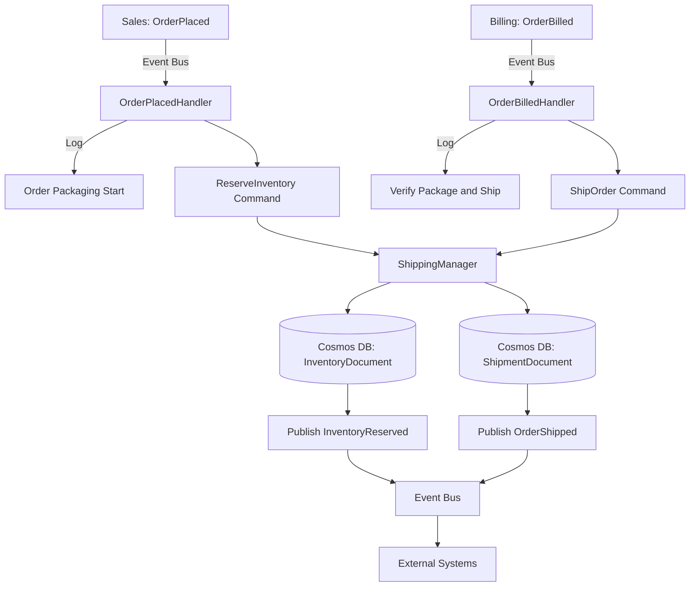

# Shipping - Technical Specification

## Architecture

### Layer Structure
```
Shipping/
├── src/
│   ├── Api/              # HTTP endpoints (NOT NEEDED - message-driven)
│   ├── Domain/           # Business logic, contracts, managers
│   ├── Infrastructure/   # Cosmos DB, NServiceBus config
│   └── Endpoint.In/      # Message handlers (OrderPlacedHandler, OrderBilledHandler)
└── test/
    ├── Unit.Tests/       # Domain & manager tests
    └── Integration.Tests/ # Message handler tests
```

### Technology Stack
- **.NET**: 10.0
- **NServiceBus**: 9.2.6
- **Cosmos DB**: Single-partition strategy
- **Azure Service Bus**: Message transport
- **xUnit**: Unit testing
- **Playwright**: Integration testing

---

## API Endpoints

**This domain is message-driven only** - no public HTTP API.
All operations triggered via subscribed events from Sales and Billing domains.

- **Endpoint.In**: Background NServiceBus host processes OrderPlaced and OrderBilled events

---

## Data Model

### Cosmos DB Container
- **Container Name**: `nsbshipping`
- **Partition Key**: `/orderId`
- **Documents**:
  - InventoryDocument (for reservations)
  - ShipmentDocument (for shipments)

### InventoryDocument

```csharp
public class InventoryDocument
{
    [JsonPropertyName("id")]
    public string Id { get; set; }  // GUID (inventory reservation ID)
    
    [JsonPropertyName("orderId")]
    public Guid OrderId { get; set; }  // Partition key (correlation ID)
    
    [JsonPropertyName("type")]
    public string Type { get; set; } = "Inventory";
    
    [JsonPropertyName("status")]
    public string Status { get; set; }  // "Reserved", "Released"
    
    [JsonPropertyName("reservedAt")]
    public DateTimeOffset ReservedAt { get; set; }
    
    [JsonPropertyName("createdAt")]
    public DateTimeOffset CreatedAt { get; set; }
    
    [JsonPropertyName("updatedAt")]
    public DateTimeOffset UpdatedAt { get; set; }
    
    [JsonPropertyName("_etag")]
    public string? ETag { get; set; }
}
```

### ShipmentDocument

```csharp
public class ShipmentDocument
{
    [JsonPropertyName("id")]
    public string Id { get; set; }  // GUID (shipment ID)
    
    [JsonPropertyName("orderId")]
    public Guid OrderId { get; set; }  // Partition key (correlation ID)
    
    [JsonPropertyName("type")]
    public string Type { get; set; } = "Shipment";
    
    [JsonPropertyName("status")]
    public string Status { get; set; }  // "Packaged", "Shipped", "Delivered"
    
    [JsonPropertyName("shippedAt")]
    public DateTimeOffset ShippedAt { get; set; }
    
    [JsonPropertyName("trackingNumber")]
    public string? TrackingNumber { get; set; }
    
    [JsonPropertyName("createdAt")]
    public DateTimeOffset CreatedAt { get; set; }
    
    [JsonPropertyName("updatedAt")]
    public DateTimeOffset UpdatedAt { get; set; }
    
    [JsonPropertyName("_etag")]
    public string? ETag { get; set; }
}
```

---

## Message Contracts

### Commands (Internal)
*Commands this domain processes*

#### ReserveInventory
```csharp
namespace RiskInsure.Shipping.Domain.Contracts.Commands;

public record ReserveInventory(
    Guid MessageId,
    DateTimeOffset OccurredUtc,
    Guid OrderId,
    string IdempotencyKey
);
```

#### ShipOrder
```csharp
namespace RiskInsure.Shipping.Domain.Contracts.Commands;

public record ShipOrder(
    Guid MessageId,
    DateTimeOffset OccurredUtc,
    Guid OrderId,
    string IdempotencyKey
);
```

### Events Published (Public Contracts)
*Events published to other domains - place in PublicContracts project*

#### InventoryReserved
```csharp
namespace RiskInsure.PublicContracts.Events;

public record InventoryReserved(
    Guid MessageId,
    DateTimeOffset OccurredUtc,
    Guid OrderId,
    string IdempotencyKey
);
```

#### OrderShipped
```csharp
namespace RiskInsure.PublicContracts.Events;

public record OrderShipped(
    Guid MessageId,
    DateTimeOffset OccurredUtc,
    Guid OrderId,
    string IdempotencyKey
);
```

### Events Subscribed
*Events this domain listens to from other domains*

- **`OrderPlaced`**: From `Sales` domain
  - Namespace: `RiskInsure.PublicContracts.Events.OrderPlaced`
  - Triggers: ReserveInventory workflow

- **`OrderBilled`**: From `Billing` domain
  - Namespace: `RiskInsure.PublicContracts.Events.OrderBilled`
  - Triggers: ShipOrder workflow

---

## Domain Logic

### Managers

#### ShippingManager (or separate InventoryManager + ShippingManager)
**Responsibilities**:
- Execute ReserveInventory workflow
- Execute ShipOrder workflow
- Manage inventory and shipment records

**Methods**:
```csharp
/// <summary>
/// Reserve inventory for an order - intuitive logic
/// </summary>
Task<InventoryDocument> ReserveInventoryAsync(ReserveInventory command);

/// <summary>
/// Ship an order - intuitive logic to verify package and ship
/// </summary>
Task<ShipmentDocument> ShipOrderAsync(ShipOrder command);
```

**Business Logic**:
- **`ReserveInventoryAsync`**:
  1. Validate OrderId is provided
  2. Check for duplicate inventory reservation (idempotency)
  3. Allocate inventory for order
  4. Create InventoryDocument with status "Reserved"
  5. Save to Cosmos DB
  6. Return result for event publishing

- **`ShipOrderAsync`**:
  1. Validate OrderId is provided
  2. Check for duplicate shipment (idempotency)
  3. Verify package contents
  4. Generate shipping label/tracking number
  5. Create ShipmentDocument with status "Shipped"
  6. Save to Cosmos DB
  7. Return result for event publishing

---

## Message Handlers

### Handlers in Endpoint.In

#### OrderPlacedHandler
**Message**: `OrderPlaced` from `Sales` domain  
**Purpose**: MustReserveOnOrderPlaced - Reserve inventory when order is placed  
**Policy**: OnOrderPlaced

**Processing Logic**:
1. Receive `OrderPlaced` event
2. Log: "Received OrderPlaced, OrderId = {OrderID} - Order Packaging Start..."
3. Call `ShippingManager.ReserveInventoryAsync()`
4. Publish `InventoryReserved` event

**Handler Implementation**:
```csharp
public class OrderPlacedHandler : IHandleMessages<OrderPlaced>
{
    private readonly ShippingManager _manager;
    private readonly ILogger<OrderPlacedHandler> _logger;

    public async Task Handle(OrderPlaced message, IMessageHandlerContext context)
    {
        _logger.LogInformation(
            "Received OrderPlaced, OrderId = {OrderID} - Order Packaging Start...",
            message.OrderId);

        // Call domain manager
        var inventory = await _manager.ReserveInventoryAsync(
            new ReserveInventory(
                MessageId: Guid.NewGuid(),
                OccurredUtc: DateTimeOffset.UtcNow,
                OrderId: message.OrderId,
                IdempotencyKey: $"ReserveInventory-{message.OrderId}"
            ));

        // Publish resulting event
        await context.Publish(new InventoryReserved(
            MessageId: Guid.NewGuid(),
            OccurredUtc: DateTimeOffset.UtcNow,
            OrderId: inventory.OrderId,
            IdempotencyKey: inventory.IdempotencyKey
        ));
    }
}
```

---

#### OrderBilledHandler
**Message**: `OrderBilled` from `Billing` domain  
**Purpose**: MustShipOnOrderBilled - Ship order when billing is complete  
**Policy**: OnOrderBilled

**Processing Logic**:
1. Receive `OrderBilled` event
2. Log: "Received OrderBilled, OrderId = {OrderID} - Verify Package and Ship..."
3. Call `ShippingManager.ShipOrderAsync()`
4. Publish `OrderShipped` event

**Handler Implementation**:
```csharp
public class OrderBilledHandler : IHandleMessages<OrderBilled>
{
    private readonly ShippingManager _manager;
    private readonly ILogger<OrderBilledHandler> _logger;

    public async Task Handle(OrderBilled message, IMessageHandlerContext context)
    {
        _logger.LogInformation(
            "Received OrderBilled, OrderId = {OrderID} - Verify Package and Ship...",
            message.OrderId);

        // Call domain manager
        var shipment = await _manager.ShipOrderAsync(
            new ShipOrder(
                MessageId: Guid.NewGuid(),
                OccurredUtc: DateTimeOffset.UtcNow,
                OrderId: message.OrderId,
                IdempotencyKey: $"ShipOrder-{message.OrderId}"
            ));

        // Publish resulting event
        await context.Publish(new OrderShipped(
            MessageId: Guid.NewGuid(),
            OccurredUtc: DateTimeOffset.UtcNow,
            OrderId: shipment.OrderId,
            IdempotencyKey: shipment.IdempotencyKey
        ));
    }
}
```

---

## NServiceBus Configuration

### Endpoint Configuration
```csharp
var endpointConfiguration = new EndpointConfiguration("RiskInsure.Shipping.Endpoint");

// Configure routing
var routing = endpointConfiguration.UseTransport<AzureServiceBusTransport>();

// Subscribe to Sales.OrderPlaced and Billing.OrderBilled events
routing.RouteToEndpoint(typeof(OrderPlaced), "RiskInsure.Sales.Endpoint");
routing.RouteToEndpoint(typeof(OrderBilled), "RiskInsure.Billing.Endpoint");
```

---

## Validation Rules
**Minimal validation approach**:
- Required fields: OrderId must be present
- Format validation: OrderId must be valid GUID
- Business rules: 
  - Process each order exactly once for inventory reservation (idempotency)
  - Process each order exactly once for shipment (idempotency)

---

## Error Handling
- **Validation errors**: Log and dead-letter message
- **Inventory unavailable**: Retry with exponential backoff or publish failure event
- **Shipping failures**: Retry with backoff
- **Business rule violations**: Log and potentially publish failure event
- **Idempotency**: Check for existing records before processing
- **Retry logic**: NServiceBus default retry policies

---

## Testing Strategy

### Unit Tests
- ShippingManager.ReserveInventoryAsync logic
- ShippingManager.ShipOrderAsync logic
- Validation logic
- Idempotency checks for both workflows

### Integration Tests
- Message handler testing (OrderPlacedHandler, OrderBilledHandler)
- Event → Command → Event flows for both workflows
- Verify InventoryReserved event published
- Verify OrderShipped event published
- Idempotency verification (duplicate events)
- Error scenario handling

---

## Event Flow Diagram



---

*Generated from DDD specification: Shipping_Systems_single_context_final.md*
